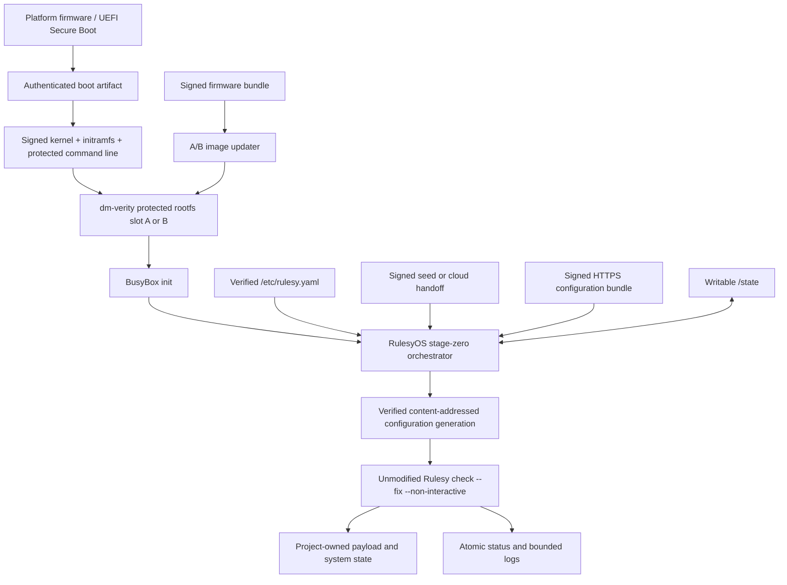
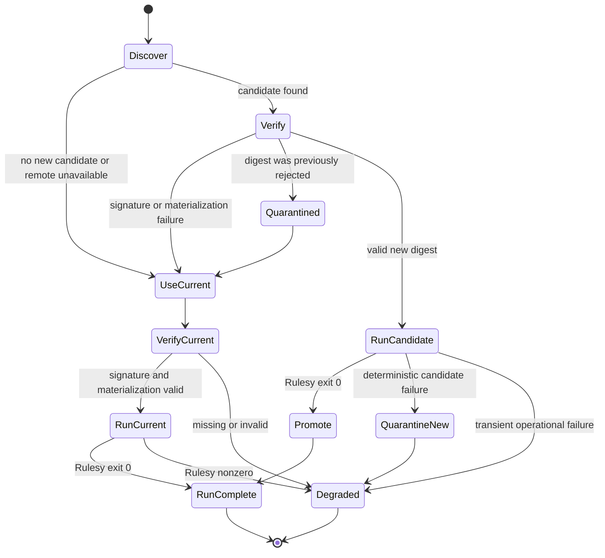

# RulesyOS

## Product Requirements and Implementation Design

**Status:** Proposed implementation handoff; not implemented

**Date:** 2026-07-25

**Product:** RulesyOS

**Related tools:** Rulesy, formerly Checksy; Rulesy Compose (`rulesy-compose`)

**Former working name:** ChecksyOS

**Audience:** An implementation agent or engineer starting the RulesyOS repository

> As of Checksy `v0.7.7`, this repository, executable, crate, default
> configuration filenames, distribution artifacts, and provisioning-lock
> namespace are still named Checksy. Rulesy, RulesyOS, and `rulesy-compose` are
> proposed names and products. This document implements none of them. See the
> [product-family and rename proposal](rulesy-product-family.md).

This document records the intended product boundary and reference architecture.
It is deliberately specific enough to begin implementation, but it does not
require Rulesy to become an operating-system framework.

## 0. Contract-freeze notes

Milestone 0 must resolve these reviewed gaps against the then-current Rulesy
source rather than assuming interfaces that do not exist:

1. **Authenticated configuration closure.** Current Checksy preserves
   per-definition working directories and strictly decodes the discovered local
   include graph, but trusted local includes and some patterns may intentionally
   escape their defining tree through `..` or absolute paths. RulesyOS cannot
   claim that an external signed bundle authenticates every executed
   configuration asset until a narrow, generic bundle-root confinement contract
   exists or stage zero can validate the complete closure without becoming a
   second Rulesy interpreter. This is a blocking design decision, not an
   invitation to add provider or OS semantics to Rulesy.
2. **Machine-readable validation results.** Current Checksy exposes stable
   overall exit classes and bounded human-readable output, not a stable
   per-rule JSON report. Rulesy Compose may bind the overall exit and captured
   output initially. Any claim about structured individual results requires a
   separately specified Rulesy output interface; the host must not parse human
   text or reinterpret Rulesy YAML.
3. **Version authority.** The release tag and CLI currently report `0.7.7`,
   while Cargo package metadata has historically used a separate version.
   Rename and Buildroot work must select one release-version authority and test
   every displayed and packaged version against it.
4. **Target libc.** Official Checksy Linux archives are static musl binaries
   beginning with `0.7.7`. The proposed x86-64 RulesyOS profile uses glibc.
   Its Buildroot package therefore builds the pinned Rulesy source for the
   selected Buildroot toolchain rather than copying the official musl archive.

All paths and commands containing `rulesy`, `rulesyos`, or `rulesy-compose`
below are proposed target interfaces.

---

## 1. Executive summary

RulesyOS is a small, firmware-style Linux substrate built with Buildroot. It
boots a hardened, recoverable base image containing only the facilities needed
to:

1. establish a trusted boot and runtime foundation;
2. discover or acquire a Rulesy configuration;
3. authenticate that configuration when it does not come from the verified
   firmware image;
4. invoke the existing Rulesy check/fix lifecycle as root and
   non-interactively; and
5. preserve enough state, logs, and recovery information to repeat the process
   safely on later boots.

RulesyOS is not intended to be a conventional package-based Linux
distribution. It has no native package repository, package manager, compiler,
interactive administration service, or general-purpose control plane.
Buildroot builds the complete stage-zero image; it is not used as an on-target
package system.

Rulesy remains a deterministic check-and-potentially-fix tool driven by trusted
configuration. RulesyOS must not add provider abstractions, resource models,
package semantics, enrollment logic, download logic, rollback semantics, or
OS-specific behavior to Rulesy itself. Configuration acquisition, signature
verification, firmware updates, boot recovery, and persistent generation
management belong to RulesyOS.

Rulesy Compose is a parallel host-side tool that combines a Rulesy
configuration with image metadata to produce and externally validate
deployable artifacts. Its first scope is raw and QCOW2 machine images; live
ISO, OCI, and cloud publication are later adapters. It uses actual Rulesy
inside disposable build and validation environments rather than implementing a
second “Rulesy-compatible” evaluator.

The configuration author owns everything above stage zero. A project may:

- remain appliance-like and install a few static artifacts into persistent
  storage;
- construct a separate root filesystem and arrange a later handoff into it; or
- install and maintain a conventional package ecosystem, accepting the
  corresponding ABI, repository, and upgrade burden.

RulesyOS should make those choices possible without pretending to manage them.

## 2. Product definition

### 2.1 One-sentence description

**RulesyOS is a verified, minimal Linux firmware image that repeatedly
converges a machine by running an authenticated Rulesy configuration.**

### 2.2 Product positioning

RulesyOS is closer to device firmware, an installer environment, or a
stage-zero appliance substrate than to Debian, Fedora, Alpine, or NixOS.
Calling it an “OS” is appropriate as a product name, but its technical
documentation should describe it as a **firmware-style Linux substrate** rather
than promise a complete general-purpose distribution.

### 2.3 Intended users

- Appliance authors who want a small, reproducible base and project-owned
  provisioning.
- Homelab operators who want the same deterministic bootstrap across physical
  and virtual machines.
- Cloud-image authors who want an authenticated configuration to converge a
  newly booted instance.
- Developers experimenting with alternate userlands without first designing an
  entire distribution.

### 2.4 Initial reference target

The first supported target SHALL be:

- x86-64;
- QEMU/KVM;
- UEFI-capable virtual hardware;
- virtio block, network, console, and random devices;
- GPT disk layout;
- glibc userland for broad binary compatibility; and
- a production-hardened configuration derived from the same reference target.

An aarch64 QEMU target is the preferred second target. Real hardware support
SHALL be added through explicit board profiles rather than by turning the
reference kernel into a universal hardware kernel.

RulesyOS v1 is Linux-only. Buildroot does not make a BSD version of this
architecture; a future BSD implementation would be a separate port sharing
product principles, not a Buildroot target.

## 3. Goals

### G1. Preserve Rulesy’s purpose

Integrate the existing Rulesy CLI and configuration format without changing its
core behavior. Rulesy checks declared conditions, runs declared fixes when
requested, and rechecks. Rulesy configuration remains trusted Bash.

### G2. Provide a small, reproducible stage zero

Build a complete kernel, boot artifacts, root filesystem, and minimal userland
from pinned sources using Buildroot and a project-owned `BR2_EXTERNAL` tree.

### G3. Establish an explicit trust chain

Production images must authenticate the boot artifacts, immutable root
filesystem, firmware updates, and any Rulesy configuration acquired from
mutable storage or the network.

### G4. Converge on every boot

Rulesy must run even when the configuration content has not changed. An
unchanged source is not evidence that the machine has remained compliant.

### G5. Recover independently of ordinary configured-payload failure

Firmware fallback, configuration last-known-good selection, status reporting,
and recovery must remain usable when a Rulesy fix or installed payload is
accidentally broken. An authorized root-running configuration can deliberately
attack boot storage unless a hardware or restricted-execution boundary
prevents it; that stronger boundary is not implied by the default profile.

### G6. Remain minimally opinionated above stage zero

RulesyOS defines a stable bootstrap contract, not the application stack. It
must not require containers, a particular package manager, a particular service
manager for payloads, or a particular final root filesystem.

### G7. Make failure states observable

An operator or automation system must be able to determine which firmware slot
booted, which configuration generation ran, what Rulesy returned, and whether a
candidate was promoted or quarantined.

### G8. Produce compliant deployable artifacts

Provide a sibling `rulesy-compose` workflow that can converge a disposable
image with Rulesy, validate the final sealed artifact from the host, and
package or publish target-specific outputs without adding artifact-building
concerns to Rulesy or the booted RulesyOS firmware.

## 4. Non-goals

RulesyOS v1 SHALL NOT:

- turn Rulesy into a daemon, scheduler, enrollment service, package manager, or
  rollback engine;
- add typed resources or providers to Rulesy;
- host a binary package repository;
- support partial in-place upgrades of the Buildroot root filesystem;
- promise transactional rollback of arbitrary Rulesy fixes;
- sandbox a configuration that has been authorized to run as root;
- protect the machine from a malicious authorized configuration signer;
- ship an SSH server, web console, compiler, language SDK, or editor by
  default;
- attempt universal PC hardware support in the first release;
- include AWS-, Azure-, or GCP-specific control-plane clients in the core
  image;
- include full cloud-init in the default firmware profile;
- manage application secrets as a first-class feature;
- define how a project’s payload services are supervised after Rulesy starts
  them;
- make the booted stage-zero environment responsible for publishing AMIs, OCI
  registries, or other external artifacts;
- guarantee that arbitrary packages built for another distribution are
  compatible with the Buildroot userland; or
- claim that retaining an older configuration reverses mutations made by a
  failed newer configuration.

## 5. Decisions and invariants

These are product decisions, not implementation suggestions.

1. **Buildroot builds stage zero.** Project customizations live in a
   `BR2_EXTERNAL` tree; do not maintain an unnecessary fork of Buildroot.
2. **The immutable firmware image is replaced as a whole.** Buildroot is an
   image builder, not the target’s runtime package manager.
3. **Rulesy is integrated as an ordinary pinned Buildroot package.**
4. **Configuration acquisition and authentication happen outside Rulesy.**
5. **Rulesy runs as UID 0 in v1.** Its configuration is therefore equivalent
   to trusted root code.
6. **Rulesy runs non-interactively.** The canonical invocation is:

   ```sh
   /usr/bin/rulesy \
     --config=/run/rulesyos/config/current/rulesy.yaml \
     check --fix --non-interactive
   ```

   The adapter SHALL be updated if the completed rename changes only spelling
   or paths. It SHALL NOT create a new Rulesy lifecycle command.
7. **Rulesy runs on every normal boot**, including when the selected
   configuration digest is unchanged.
8. **The reference root filesystem is SquashFS protected by dm-verity and
   mounted read-only.** Persistent project-owned content lives under `/state`.
9. **There is no writable root overlay by default.** A project may construct
   one from Rulesy if it accepts the complexity.
10. **No network service listens by default.** Stage zero needs outbound
    network access, not inbound administration.
11. **Firmware state and configuration state are independent.** A failed
    Rulesy configuration does not automatically mark a firmware slot bad.
12. **Firmware signing keys and Rulesy-configuration signing keys are
    distinct.**
13. **Unsigned external configuration is rejected in production.** A
    configuration built into the verified root filesystem is already covered
    by the firmware trust chain.
14. **The production build contains no development signing private keys.**
15. **The base remains bootable and diagnosable without a valid Rulesy
    configuration.**
16. **A locked-down kernel is a measurable profile, not an absolute claim.**
    Every enabled attack-surface exception is documented and tested.
17. **The default execution profile trusts the configuration signer with the
    machine.** Read-only firmware is not, by itself, containment from
    authorized root code.
18. **Rulesy Compose is a sibling host-side CLI.** It is not installed in the
    production firmware image and does not expand Rulesy’s configuration
    semantics.
19. **Artifact compliance is evaluated by actual Rulesy.** The host
    orchestrates and observes validation but does not reinterpret arbitrary
    Rulesy Bash.
20. **Building and publishing are separate actions.** A local build can be
    credential-free; registering an AMI or pushing an OCI artifact is an
    explicit external mutation.

## 6. Architectural overview



The architecture has two independent recovery loops:

### Firmware loop

Select an A/B firmware slot, verify it, boot it, perform stage-zero self-tests,
and mark that firmware slot good. Firmware health does not depend on the current
project configuration successfully converging.

### Configuration loop

Discover a source, acquire and verify a candidate, execute it through Rulesy,
and atomically promote it only after Rulesy succeeds. A failed candidate is
quarantined by digest while the previous active generation remains selected.

Keeping these loops separate prevents:

- a bad project configuration from rolling back an otherwise necessary
  firmware security update; and
- a failed firmware boot from being confused with ordinary configuration
  noncompliance.

## 7. Major components

### 7.1 Build pipeline

Responsibilities:

- pin Buildroot, Linux, Rulesy, stage-zero code, and all downloaded source
  revisions;
- cross-compile the kernel and userland;
- produce disk images and update bundles;
- create the root filesystem integrity metadata;
- produce checksums, signatures, SBOMs, license material, and release
  metadata;
- create development-only test keys for QEMU fixtures; and
- support clean, non-interactive CI builds.

The build pipeline must not silently use a moving branch for any release input.

### 7.2 Bootloader and initramfs

Responsibilities:

- participate in the platform verified-boot chain;
- select the active firmware slot;
- expose the selected slot identity to userspace through an authenticated
  command line or equivalent mechanism;
- establish the dm-verity mapping;
- mount the immutable root filesystem read-only;
- mount `/state`, `/run`, and `/tmp`;
- fall back to another valid firmware slot or recovery path when boot
  verification fails; and
- start the normal init process.

The dm-verity root hash must itself be authenticated. Merely storing a hash
next to the data it verifies is not a trust chain.

### 7.3 Immutable stage-zero root filesystem

Contains:

- `/usr/bin/rulesy`;
- Bash;
- BusyBox and the documented applet set;
- the stage-zero orchestrator;
- the configuration signature verifier and trust anchors;
- HTTPS download support and a CA bundle;
- the firmware updater;
- boot and recovery scripts;
- kernel modules only when a board profile cannot use built-in drivers;
- default hardening configuration; and
- optional `/etc/rulesy.yaml`.

Does not contain:

- a package manager;
- Git;
- an SSH server;
- a compiler or SDK;
- Python, Node.js, Ruby, or another general runtime unless a specific profile
  requires it;
- project payloads; or
- production private keys.

### 7.4 RulesyOS stage-zero orchestrator

Use one small, auditable program, tentatively named `rulesyos-stage0`. Rust is
preferred because Rulesy already uses Rust and Buildroot has Cargo package
infrastructure.

Responsibilities:

- obtain a process-level singleton lock for its own state transitions;
- identify the boot and firmware slot;
- mount or validate the required writable and transient directories;
- select exactly one configuration source using deterministic precedence;
- download external artifacts with bounded time and size;
- verify detached signatures against pinned trust anchors;
- safely materialize a content-addressed generation;
- maintain candidate/current/previous/quarantined metadata atomically;
- invoke Rulesy with a fixed, non-interactive environment;
- interpret Rulesy’s documented exit statuses;
- record status without exposing secrets;
- promote a successful candidate;
- retain or select last-known-good state after failures;
- after successful convergence, optionally launch the project-owned foreground
  payload hook; and
- mark the firmware slot good after stage-zero firmware self-tests,
  independently of Rulesy convergence.

It must not:

- parse or reinterpret Rulesy rules;
- decide whether an individual rule is idempotent;
- implement a second check/fix engine;
- synthesize shell commands;
- silently weaken signature policy;
- claim to reverse Rulesy mutations; or
- execute project-owned state before its controlling configuration has been
  authenticated.

### 7.5 Rulesy

Rulesy is an immutable stage-zero binary. The integration assumes the following
existing contract:

- explicit local configuration through `--config`;
- `check --fix`;
- `--non-interactive`;
- strict configuration decoding before configured commands execute;
- arbitrary trusted Bash with the invoker’s authority;
- check, optional fix, and final recheck behavior;
- bounded command supervision;
- a per-effective-user provisioning lock; and
- stable exit statuses.

At implementation kickoff, inspect the current Rulesy source and tests rather
than assuming this document’s snapshot is still exact. Preserve the current
public lifecycle and adapt only the RulesyOS wrapper when necessary.

RulesyOS configurations must be self-contained or use local includes contained
in the authenticated bundle. The default image does not include Git and does
not support Rulesy’s legacy `git+` remote configuration references.
Acquisition belongs to stage zero, and every file needed to decode the
configuration must exist before Rulesy begins.

The confinement caveat in [section 0](#0-contract-freeze-notes) must be
resolved before an external bundle can be called content-complete.

### 7.6 Persistent state

`/state` is the only project-neutral persistent writable hierarchy guaranteed
by stage zero.

RulesyOS-owned state lives under `/state/rulesyos` with root-only ownership and
restrictive permissions. Project payloads should use sibling directories such
as `/state/bin`, `/state/opt`, `/state/roots`, or project-selected paths.

Stage zero must treat `/state` as mutable and potentially corrupted. It must
not trust a cached digest, source descriptor, executable, symlink, or status
file merely because it is root-owned. Security-sensitive reads and writes must
avoid symlink following, verify file type and ownership where meaningful, use
same-filesystem temporary files, fsync when durability matters, and finish with
atomic rename.

### 7.7 Firmware updater

Use a mature image-based updater rather than inventing an A/B update protocol.
RAUC is the preferred initial choice because it supports signed image bundles,
redundant slots, bootloader integration, and explicit boot confirmation.

For the BusyBox-init reference profile, prefer RAUC’s direct CLI integration
without D-Bus service mode unless an implemented requirement demonstrates the
need for the additional service stack.

Responsibilities:

- accept only firmware bundles signed by the firmware update trust root;
- write only inactive slots;
- update boot selection atomically;
- boot the candidate with a bounded attempt count;
- mark the candidate good only after firmware self-tests pass;
- roll back to the prior slot after boot failure; and
- expose status through `rulesyosctl` or an equivalent small interface.

Rulesy configuration may request a firmware update because it runs as root, and
the supported updater path still verifies the firmware bundle with its separate
key. Unrestricted root can bypass that path if raw boot devices remain
accessible. Cryptographically enforcing exclusive updater ownership requires
hardware write protection or a restricted Rulesy execution profile.

### 7.8 Recovery environment

The signed initramfs is the minimum recovery environment. It must be capable of:

- detecting that both normal slots are invalid;
- reporting the failure on the configured console;
- applying a signed firmware bundle from approved local media or an explicitly
  configured URL;
- clearing only safe, narrowly scoped RulesyOS state;
- selecting a known-good firmware slot; and
- rebooting.

A production image must not drop automatically into an unauthenticated root
shell. A development profile may expose a console shell with an unmistakable
insecure-build banner.

## 8. Storage and mount model

The logical layout is:

| Region | Normal mount | Mutability | Purpose |
| --- | --- | ---: | --- |
| Boot metadata / ESP | platform-specific | Controlled | Bootloader, signed boot artifacts, slot state |
| Firmware root A | `/` when active | Read-only | Complete Buildroot SquashFS stage-zero image |
| Firmware root B | inactive | Read-only | Redundant complete SquashFS stage-zero image |
| Verity metadata | initramfs-managed | Read-only | Integrity tree for each root slot |
| State | `/state` | Read-write | RulesyOS metadata and all project-owned persistent content |
| Runtime | `/run` | tmpfs | Locks, active mounts, source inbox, current-boot status |
| Temporary | `/tmp` | tmpfs | Bounded transient work |
| Variable runtime | `/var` | tmpfs | Writable conventional runtime hierarchy, including Rulesy’s root lock path |
| Optional seed media | `/config` | Read-only | Signed first-boot configuration or source descriptor |

Exact partition sizes are board-specific. The QEMU reference image should use
GPT and leave documented expansion room for `/state`.

### 8.1 Root filesystem behavior

- `/` is mounted read-only after dm-verity activation.
- `/run` and `/tmp` are fresh tmpfs mounts on every boot.
- `/var` is a fresh tmpfs hierarchy. Before invoking Rulesy, stage zero creates
  the renamed equivalent of `/var/lib/checksy` with the ownership and mode
  required by Rulesy’s provisioning lock.
- `/state` is mounted `nodev,nosuid` by default but remains executable because
  the central product use case is installing project artifacts there.
- No general overlay is mounted over `/`.
- `/etc`, `/usr`, and the stage-zero binaries cannot be persistently changed by
  ordinary Rulesy fixes.
- A configuration that needs conventional writable filesystem locations may
  create bind mounts, an overlay, a chroot, or another root under `/state`;
  that policy belongs to the project.

The absence of a default overlay is intentional. A persistent upper layer can
shadow files from a newly updated lower firmware image and create combinations
that were never built or tested together. If a project creates an overlay, it
must version that upper layer by firmware compatibility and keep application
data separate from overlay metadata.

### 8.2 Suggested on-disk state hierarchy

```text
/state/
  rulesyos/
    config/
      objects/<sha256>/
      current
      previous
      candidate
      quarantine/
    source/
      enrolled-source.json
    status/
      latest.json
      history/
    logs/
    update/
  bin/
  opt/
  roots/
```

`current`, `previous`, and `candidate` are logical names. The implementation may
use symlinks, small metadata files, or a database, provided selection and
promotion are atomic and resilient to power loss.

For every external generation, retain the original signed archive and detached
signature. Do not treat a previously extracted tree under mutable `/state` as
authenticated on a later boot. Reverify the selected archive and freshly
materialize its execution tree under `/run/rulesyos/config` before every Rulesy
invocation. A content-addressed pathname is organization, not proof that
mutable bytes still match the name.

## 9. Stage-zero runtime contract

The stage-zero contract is the small API Rulesy configurations may rely upon.
It must be versioned and tested.

### 9.1 Filesystem contract

- `/` — authenticated, read-only firmware root.
- `/state` — persistent, project-writable storage.
- `/run` — current-boot tmpfs.
- `/tmp` — current-boot tmpfs.
- `/var` — current-boot writable tmpfs, including Rulesy’s root
  provisioning-lock directory.
- `/config` — optional read-only seed media.
- `/usr/bin/rulesy` — immutable Rulesy binary.
- `/usr/bin/rulesyosctl` — optional stable status/update helper.
- `/state/rulesyos/boot` — optional project-owned foreground payload hook,
  launched only after successful convergence.

### 9.2 Execution contract

- Rulesy executes as root.
- Provisioning is non-interactive and receives no usable terminal.
- The entrypoint is passed explicitly with `--config`.
- The config generation directory is the effective filesystem context for
  relative includes, patterns, and commands, consistent with current behavior
  after the bundle-confinement decision in [section 0](#0-contract-freeze-notes).
- `PATH` initially contains only stage-zero system paths and `/state/bin`:

  ```text
  /state/bin:/usr/sbin:/usr/bin:/sbin:/bin
  ```

- Stage zero provides these environment variables:

  ```text
  RULESYOS=1
  RULESYOS_VERSION=<firmware-version>
  RULESYOS_FIRMWARE_SLOT=<slot-id>
  RULESYOS_STATE_DIR=/state
  RULESYOS_CONFIG_DIGEST=<sha256>
  RULESYOS_CONFIG_SOURCE=<non-secret-source-kind>
  ```

- URL credentials, detached signatures, private metadata tokens, and other
  acquisition secrets must not be placed in the Rulesy environment.

### 9.3 Guaranteed tools

The exact applet list must be checked into `docs/stage-zero-contract.md` and
validated in CI. The initial contract should include:

- Bash;
- BusyBox file, text, process, networking, mount, and archive basics;
- `curl` with HTTPS and CA validation;
- `sha256sum`;
- gzip, xz, and zstd decompression;
- tar and unzip for ordinary project artifacts;
- `chroot`, `mount`, `umount`, `losetup`, and block-device discovery needed for
  bootstrap work;
- DHCP, DNS, IP configuration, and route inspection;
- a compact detached-signature verifier used by stage zero; and
- firmware status/update commands.

The contract intentionally excludes Git, a compiler, a package manager, full
GNU coreutils, and general scripting runtimes. Configurations may install those
under `/state`.

Because Rulesy executes Bash rather than generic POSIX shell, Bash is a required
stage-zero dependency, not an optional convenience.

### 9.4 ABI contract

The x86-64 reference profile uses glibc to maximize compatibility with
downloaded dynamically linked artifacts. This does not guarantee compatibility
with packages from another distribution.

Projects needing a different libc may:

- install static binaries;
- use a separate chroot/root filesystem with its own libc; or
- define another RulesyOS board/profile built with musl or uClibc.

The libc and architecture are part of a profile’s published stage-zero
contract and must not change silently within a release line.

## 10. Configuration sources

### 10.1 Design principle

Rulesy consumes a trusted local file. RulesyOS is responsible for turning an
external source into that trusted local file.

Do not add HTTP, cloud metadata, signature, enrollment, or
generation-management behavior to Rulesy.

### 10.2 Deterministic precedence

The default source precedence is:

1. an explicit source descriptor named by an authenticated kernel command-line
   option;
2. one signed artifact in `/run/rulesyos/inbox`, normally written by an
   optional cloud integration;
3. one signed artifact or source descriptor on read-only `/config` seed media;
4. an enrolled source descriptor in
   `/state/rulesyos/source/enrolled-source.json`;
5. a baked `/etc/rulesy.yaml` in the verified firmware image.

Rules:

- The first populated tier wins.
- Multiple candidates within the same tier are an error.
- Selection is logged by kind and digest, never by secret-bearing URL.
- A malformed higher-priority candidate is not silently ignored in favor of a
  lower-priority candidate.
- An unauthenticated kernel command line must not be allowed to weaken
  production verification policy.

### 10.3 Supported source kinds

#### Baked configuration

`/etc/rulesy.yaml` and any adjacent included files are covered by the verified
firmware image. No additional signature is required.

#### Signed local bundle

A configuration bundle and detached signature may arrive through a seed disk,
removable media, cloud handoff directory, or another local provisioning
mechanism.

The v1 configuration signature format SHALL be Minisign’s current hashed
format: Ed25519 over a BLAKE2b-512 prehash of the artifact. Production
verification SHALL reject Minisign’s legacy unprehashed format. Public keys and
allowed key identifiers live in the verified root under
`/etc/rulesyos/trust.d`; secret keys never appear in the image.

#### Enrolled HTTPS bundle

A source descriptor identifies:

- schema version;
- HTTPS artifact URL;
- detached-signature URL or naming rule;
- trusted key identifier;
- expected entrypoint, normally `rulesy.yaml`;
- optional maximum acceptable age or version policy; and
- optional HTTP caching metadata.

Illustrative v1 descriptor:

```json
{
  "schemaVersion": 1,
  "kind": "https-bundle",
  "url": "https://config.example.invalid/device-class/config.tar.zst",
  "signatureUrl": "https://config.example.invalid/device-class/config.tar.zst.minisig",
  "keyId": "site-production-1",
  "entrypoint": "rulesy.yaml"
}
```

The exact schema must be closed to unknown fields, versioned, and covered by
parser fixtures. Do not place credentials in kernel arguments or URLs because
command lines and diagnostics are often locally readable.

The artifact signature is authoritative. ETag, Last-Modified, and SHA-256 are
useful for caching and corruption detection but are not signer authentication.

TLS validation still requires a plausible clock on most platforms. Each
network-enabled board profile must define its early-boot time source or require
a usable RTC. Do not “solve” bootstrap clock failure by disabling certificate
verification. A local signed seed remains the recovery provisioning path when
trusted network acquisition cannot be established.

### 10.4 Configuration bundle format

The initial portable format should be a signed, compressed archive with:

```text
rulesyos-manifest.json
rulesy.yaml
files-or-directories-referenced-by-rulesy.yaml
```

Requirements:

- sign and verify the exact archive bytes; do not parse and reserialize Rulesy
  YAML before authentication;
- eliminate verify/use races by verifying and extracting from the same opened
  immutable snapshot, preferably a bounded copy in tmpfs;
- verify the detached signature before extraction;
- impose build-configurable compressed and expanded size limits;
- impose a file-count limit;
- reject absolute paths and `..` traversal;
- reject device nodes, FIFOs, sockets, setuid/setgid bits, and unexpected hard
  links;
- either reject symlinks entirely or validate that every symlink stays inside
  the generation;
- write into a new directory on the same filesystem as the final object store;
- fsync material state before promotion; and
- use the authenticated artifact digest as the generation identifier.

The signed manifest should contain only stage-zero metadata:

- manifest schema version;
- Rulesy entrypoint path;
- opaque generation or sequence;
- signing-key identifier;
- optional board/profile compatibility constraint;
- optional minimum RulesyOS version; and
- an optional closed map of bounded, non-secret `RULESY_CONTEXT_*` strings that
  stage zero exports identically on every run of that generation.

Execution context cannot override `PATH`, shell or dynamic-loader settings,
RulesyOS-reserved variables, or arbitrary environment names. It must not
duplicate, reinterpret, or extend the Rulesy rule model. A generation field
supports policy and diagnostics, but is not strong anti-rollback unless the
comparison state is protected by trusted monotonic storage.

An external plain YAML file is permitted only when it is self-contained and
accompanied by a valid detached signature. Use a bundle whenever Rulesy local
includes or pattern-selected scripts are required.

Do not place legacy `git+` Rulesy remote references in a RulesyOS configuration
bundle. Resolve and authenticate those inputs during bundle creation instead.

### 10.5 Cloud-init integration

Cloud-init is an integration mechanism, not a default stage-zero dependency.

A future `rulesyos-cloud` profile may include cloud-init or layer it into a
derived image. Its only required integration contract is:

1. obtain the signed Rulesy bundle and detached signature through the cloud’s
   normal provisioning path;
2. write them into `/run/rulesyos/inbox`;
3. complete before `rulesyos-stage0` selects a source; and
4. avoid passing unsigned arbitrary user-data directly to Rulesy.

The default firmware image should not parse generic cloud-init MIME documents
or contain provider-specific metadata clients. A thin NoCloud/config-drive
adapter may be added later if it does not weaken the core source contract.

## 11. Configuration generation lifecycle

### 11.1 State machine



The final outcome-to-quarantine policy must distinguish repeatable
content/configuration rejection from transient local operational failure.
Lock contention, interruption, temporary resource exhaustion, or an unhealthy
stage-zero dependency must not permanently suppress an otherwise valid digest.
The exact classification is a milestone-2 contract and fixture set.

### 11.2 Required behavior

1. Discover the selected source.
2. Use conditional HTTP requests to avoid unnecessary downloads when
   applicable.
3. If acquisition is unavailable, use the active generation if one exists and
   still verifies.
4. If a new artifact arrives, verify and materialize it under its content
   digest.
5. If that digest is quarantined, do not execute it again automatically.
6. Before executing any external current or candidate generation, reverify its
   retained archive and signature and materialize a fresh read-only execution
   tree under `/run`.
7. If the digest equals the active digest, run the active generation anyway.
8. For a new valid digest, invoke Rulesy against the candidate without changing
   `current`.
9. Promote the candidate atomically only after Rulesy returns success.
10. Retain at least the active and previous successful signed generations.
11. Record a deterministically rejected candidate’s digest and result in
    quarantine; retain retryable operational failures without automatically
    quarantining the content.
12. Do not automatically execute both a partially failed candidate and the
    previous configuration in the same boot. Preserve the previous pointer and
    enter a degraded state; a later boot may run the previous generation while
    a deterministically failed digest remains quarantined.
13. Permit an explicit operator retry or a newly signed artifact with a new
    digest.

### 11.3 Rulesy invocation and exit mapping

Invoke:

```sh
/usr/bin/rulesy \
  --config=/run/rulesyos/config/candidate/rulesy.yaml \
  check --fix --non-interactive
```

Do not pass `--no-fail`.

Expected exit interpretation based on the current Rulesy contract:

| Exit | Meaning | RulesyOS action |
| ---: | --- | --- |
| 0 | Successful run | Promote candidate or confirm current |
| 1 | Usage/no-command fallback | Treat as integration/operational failure |
| 2 | Invalid invocation/configuration or operational failure | Do not promote; classify the failure before deciding whether content is quarantined |
| 3 | Unmasked compliance failure | Do not promote; report degraded and apply the defined candidate-quarantine policy |
| 4 | Provisioning lock contention | Treat as retryable operational failure; do not promote or quarantine content |
| signal/other | Interrupted or unexpected failure | Do not promote; record details without automatically quarantining content |

The current decoder validates the complete configuration graph before
configured commands begin. Preserve that property and cover it with an
integration test. This does not mean opaque shell-referenced assets are
discoverable or validated.

### 11.4 Last-known-good limitation

Last-known-good protects configuration selection, not the machine from
arbitrary changes already made by Bash.

A candidate may:

1. pass several checks;
2. perform several fixes;
3. fail later; and
4. leave persistent partial mutations under `/state` or on attached devices.

RulesyOS must report this honestly. It must never describe configuration
pointer rollback as transactional system rollback.

## 12. Boot lifecycle

The normal boot sequence is:

1. Platform firmware authenticates the bootloader or boot artifact.
2. The boot chain authenticates the kernel, initramfs, and protected command
   line.
3. The initramfs chooses the requested A/B slot.
4. The initramfs authenticates the dm-verity root hash and activates the
   read-only mapping.
5. The immutable root filesystem mounts.
6. `/run`, `/tmp`, `/state`, and optional `/config` mount.
7. BusyBox init starts essential device and network initialization.
8. Stage zero performs firmware self-tests.
9. The firmware slot is marked good when those self-tests succeed. This step
   does not wait for project convergence.
10. Stage zero discovers/acquires a Rulesy configuration.
11. Stage zero invokes Rulesy once using the generation lifecycle above.
12. Status and logs are written atomically.
13. If present and eligible, stage zero launches `/state/rulesyos/boot` as the
    project-owned foreground payload hook.
14. BusyBox init and stage zero remain alive to reap, report, and shut down the
    payload hook.

### 12.1 No valid configuration

When no valid configuration and no active generation exist:

- mark the machine `unprovisioned`;
- keep the verified base running;
- log the searched source tiers;
- optionally retry a configured network source with bounded exponential
  backoff;
- expose status on the local console and status file;
- do not start an inbound administration service; and
- do not open a production root shell automatically.

### 12.2 Reboot and handoff requests

Rulesy configurations can technically invoke `reboot` because they run as root.
For predictable reporting, provide a small `rulesyosctl request-reboot`
mechanism that records the reason and lets stage zero reboot after status has
been committed.

A standardized alternate-root handoff is not required for the first MVP.
Reserve a future `rulesyosctl request-handoff` interface rather than teaching
Rulesy about roots or init systems.

### 12.3 Payload boot hook

Rulesy’s process supervisor intentionally does not treat an ordinary background
child as a completed fix. Therefore a configuration must not rely on
`daemon &` inside a Rulesy fix as its durable service-launch mechanism.

The minimal RulesyOS runtime handoff is:

1. Rulesy checks and, when necessary, installs the project’s artifacts and
   service supervisor under `/state`.
2. Rulesy checks that `/state/rulesyos/boot` has the intended content and
   dependencies.
3. Rulesy exits successfully.
4. Stage zero opens `/state/rulesyos/boot` without following symlinks, verifies
   that it is a root-owned regular executable with safe mode and link count,
   and launches it.
5. The hook remains in the foreground and owns project service supervision. It
   may be a small application, an `exec` script, runit, s6, or another
   project-selected supervisor.
6. In v1, if the hook exits, stage zero records a degraded payload result and
   does not restart it implicitly. The project-selected foreground supervisor
   is responsible for service restarts. A later restart policy must be explicit
   and versioned.

The hook is trusted because the authenticated root-running configuration has
just converged the state that contains it. It is not a sandbox or a
cryptographic integrity boundary for mutable payload state. A profile needing
stronger payload integrity should use signed payload artifacts and a separate
verified or read-only payload root.

## 13. Payload models

RulesyOS intentionally supports three levels of ambition.

### Model A: Firmware-style appliance

The preferred and easiest model.

- Download static or profile-compatible binaries into `/state/bin` or
  `/state/opt`.
- Write project data and configuration under `/state`.
- Install a foreground payload launcher or supervisor at
  `/state/rulesyos/boot`.
- Continue using the RulesyOS kernel and stage-zero root.
- Update the firmware and project payload independently.

This model receives first-class examples and tests.

### Model B: Construct another root filesystem

The configuration may:

- download or extract a root filesystem into `/state/roots/<name>`;
- prepare mounts, networking, users, and boot metadata;
- run tools inside it with `chroot`; and
- arrange a board-specific or future standardized handoff.

RulesyOS v1 supplies the basic filesystem and mount primitives but does not
promise that an arbitrary distribution init system can be launched as a nested
or replacement PID 1. A reliable generic handoff requires a separate design
for namespaces, mount ownership, shutdown, watchdogs, and recovery.

### Model C: Add a package ecosystem

The configuration may install a package manager and repositories into
project-owned state or a constructed root.

The project author owns:

- repository authenticity and keys;
- libc and ABI compatibility;
- dependency resolution;
- partial-upgrade behavior;
- package database durability;
- package security updates;
- rollback and recovery;
- license compliance; and
- interaction with firmware updates.

RulesyOS does not generate or host target binary packages. If project
requirements fundamentally depend on native compilation and
distribution-style package management on the target, a conventional
distribution, Yocto/OpenEmbedded, or another full distribution build system may
be a better base.

## 14. Rulesy Compose: compliant artifact generation

### 14.1 Product boundary

`rulesy-compose` is a parallel CLI to `rulesy`:

```text
rulesy
  Converges and checks the machine on which it is running.

rulesy-compose
  Builds, externally validates, packages, and optionally publishes
  deployable artifacts that must comply with a Rulesy configuration.

RulesyOS
  Supplies a controlled bootable substrate and base artifacts that
  rulesy-compose can use for machine-image and OCI-image construction.
```

Rulesy Compose is host-side build tooling. It must not be installed in the
production RulesyOS root filesystem and must not turn the stage-zero runtime
into a cloud-image publisher.

Rulesy Compose consumes two distinct inputs:

1. a normal Rulesy configuration describing required machine or container
   state; and
2. a composition document describing semantic variants, bases, artifact
   formats, validation policy, and publication destinations.

The composition document must not duplicate or extend the Rulesy rule language.
Rulesy remains the only implementation of check/fix semantics.

### 14.2 Primary use case

The intended workflow is:

```text
Rulesy configuration
    + composition metadata
    + pinned RulesyOS base artifact
        ↓
Disposable target environment
        ↓
Rulesy check --fix
        ↓
Seal and package target
        ↓
Host-controlled validation of the exact packaged artifact
        ↓
Deployable artifact + validation report + provenance
```

For a service appliance, Rulesy installs the service and its project-owned
foreground boot hook into the working image. The resulting AMI, ISO, raw disk,
or other machine image is already converged when deployed. Every normal
RulesyOS boot still rechecks its retained authenticated configuration, but
first boot should not need to download and assemble the service again.

### 14.3 Composition document

Illustrative schema:

```yaml
apiVersion: compose.rulesy.dev/v1
kind: Composition

metadata:
  name: example-service
  version: 1.4.2

rulesy:
  source: ./rulesy-bundle/
  digest: sha256:aaaaaaaaaaaaaaaaaaaaaaaaaaaaaaaaaaaaaaaaaaaaaaaaaaaaaaaaaaaaaaaa
  signature: ./rulesy-bundle.minisig
  trustedKeyId: example-service-release

variants:
  - id: machine
    kind: rulesyos-machine
    architecture: x86_64
    base:
      ref: rulesyos-0.1.0
      digest: sha256:bbbbbbbbbbbbbbbbbbbbbbbbbbbbbbbbbbbbbbbbbbbbbbbbbbbbbbbbbbbbbbbb

  - id: container
    kind: rulesyos-oci
    architecture: x86_64
    base:
      ref: rulesyos-oci-rootfs-0.1.0
      digest: sha256:cccccccccccccccccccccccccccccccccccccccccccccccccccccccccccccccc

artifacts:
  - kind: raw
    id: raw-disk
    fromVariant: machine
    output: dist/example-service.raw

  - kind: qcow2
    id: qemu-disk
    fromVariant: machine
    output: dist/example-service.qcow2

  - kind: iso
    id: live-iso
    fromVariant: machine
    mode: live
    statePolicy: ephemeral
    output: dist/example-service.iso

  - kind: oci
    id: oci-archive
    fromVariant: container
    output: dist/example-service.oci.tar
    entrypoint:
      - /opt/example-service/bin/server
    user: "1000:1000"

publications:
  - kind: aws-ami
    id: us-east-1-ami
    sourceArtifact: raw-disk
    region: us-east-1
    name: example-service-1.4.2
    importMode: snapshot-register
    bootMode: uefi

validation:
  rulesy: true
  reboot: true
  probes:
    - kind: tcp
      port: 8080
```

The actual schema SHALL:

- be versioned and closed to unknown fields;
- snapshot an author-selected bundle root plus the complete Rulesy
  configuration closure within it, including includes, patterns, and declared
  helpers, rather than attempting to infer arbitrary files referenced by Bash;
- distinguish a semantic **variant** that Rulesy converges, a local
  **artifact** that packages that state, and an external **publication** that
  consumes an artifact;
- permit one Rulesy configuration to produce several explicitly named variants
  and artifacts;
- give every node a stable identifier and model dependencies as an acyclic
  graph;
- require content digests for release-mode base artifacts;
- distinguish local artifact generation from external publication;
- keep credentials out of the document;
- distinguish live ISO and installer ISO semantics;
- define variant-specific container metadata outside Rulesy; and
- support semantic-variant conditions without changing the Rulesy schema.

The Rulesy source may be one ordinary `rulesy.yaml` with no auxiliary files or
a bundle root containing the configuration, includes, patterns, and declared
helpers. The local path is convenient authoring input, not the execution
source. Rulesy Compose snapshots the entire selected bundle root, validates the
Rulesy-resolved include and pattern closure according to the milestone-0
confinement contract, and produces the same canonical, content-addressed bundle
format consumed by RulesyOS. It does not claim to discover opaque Brewfiles,
templates, or other paths embedded in arbitrary shell text; authors include
such assets by placing them inside the selected bundle root.

Convergence and validation use that immutable snapshot. In production release
mode, a machine variant requires a signed bundle whose public key is already
trusted by the selected RulesyOS base, or a separately built and signed derived
base containing the project trust anchor. A generic base cannot authenticate an
arbitrary project configuration merely because Compose supplied it.
Development builds may use conspicuously separate development trust roots.

During composition, expose stable, non-secret semantic context such as:

```text
RULESY_CONTEXT_ORIGIN=compose
RULESY_CONTEXT_VARIANT=machine
RULESY_CONTEXT_PLATFORM=rulesyos-machine
RULESY_CONTEXT_ARCH=x86_64
```

A portable Rulesy configuration may use ordinary `skip-if` predicates against
these values. Artifact formats and publishers are intentionally absent:
packaging one machine state as raw and QCOW2 must not cause different
convergence. Any context that can affect rule selection is authenticated with
the retained configuration generation and exported identically by stage zero
on every later boot. Otherwise that configuration is not eligible for retained
runtime convergence.

### 14.4 CLI

Initial command surface:

```sh
rulesy-compose build compose.yaml
rulesy-compose validate compose.yaml --artifact raw-disk
rulesy-compose inspect dist/example-service.raw
rulesy-compose sign compose.yaml --artifact raw-disk
rulesy-compose publish compose.yaml --publication us-east-1-ami
```

Recommended behavior:

- `build` resolves inputs, creates working images, converges them, seals them,
  packages local outputs, and writes reports.
- `validate` evaluates an existing local artifact without modifying it.
- `inspect` reports metadata, inputs, digests, variant/artifact compatibility,
  and previous validation results without booting or publishing.
- `sign` creates a detached signature or attestation for an already validated
  digest through an explicit key provider. Signing must not change the
  artifact bytes; if it does, the changed artifact requires validation.
- `publish` performs explicit credentialed mutations such as registering an
  AMI or pushing an OCI artifact.

Provide `--variant`, `--artifact`, and `--publication` selectors rather than
overloading one “target” term. Building a publication selector builds and
validates its local source dependency and records a pending publication; it
does not create a cloud resource. `publish` refuses a missing, stale, failed,
or digest-mismatched validation record. Publishing must never happen as a
hidden side effect of `build`.

### 14.5 Build lifecycle

For a bootable-machine artifact, Rulesy Compose SHALL:

1. Resolve the composition, snapshot and hash the complete selected bundle
   root and controllable input closure, and write or verify `compose.lock`.
2. Resolve the requested variant, artifact, and dependency graph.
3. Verify the base digest, configuration-bundle signature, and compatibility
   between the bundle signing key and the base trust policy.
4. Copy the pinned base disk into an isolated working directory without using
   a hard link.
5. Attach the valid signed bundle through the normal RulesyOS seed mechanism.
6. Boot the working image under QEMU using its normal RulesyOS stage-zero path.
7. Observe stage zero invoke the pinned real Rulesy binary with
   `check --fix --non-interactive`, and require an unmasked successful status
   through the stable host/guest channel.
8. Shut down cleanly and preserve the authenticated configuration generation
   required for normal boot-time rechecking.
9. Seal machine-specific state.
10. Package the requested local output from the sealed state.
11. Freeze and digest that packaged artifact.
12. Use one disposable clone for check-only compliance validation of that
    exact packaged artifact.
13. Use a separate disposable clone, with no validation seed or build-only
    environment, for a deployment-faithful boot through the retained
    configuration and declared payload path.
14. Run artifact inspection and declared black-box probes.
15. Discard all validation state.
16. Emit checksums, lock data, provenance, SBOM references, and validation
    reports.

Machine composition must not bypass `rulesyos-stage0`, directly invoke a second
concurrent Rulesy process, or use an unsigned `/config/rulesy.yaml` shortcut in
release mode. Direct invocation of pinned Rulesy is appropriate inside an OCI
build container or an explicitly insecure development-only adapter.

Running actual Rulesy inside the target is authoritative for its check/fix
semantics because the rules describe the target machine. It is not remote
attestation against a malicious artifact or malicious authorized
configuration. A verified stage zero, locked evaluator digest, isolated
host/guest protocol, artifact inspection, and deployment-faithful boot provide
the evidence around that result. An offline chroot mode may later optimize
filesystem-only compositions, but it cannot replace booted validation for
rules involving services, networking, mounts, devices, the kernel, or boot
behavior.

Every compliance-bearing output format must be validated after its final format
conversion. A successful check of a working raw disk is not automatically
evidence for a subsequently converted QCOW2, ISO, or OCI artifact. A
publication may reuse an exact validated local source artifact by digest, but
it must not silently reconverge a different image.

### 14.6 Variant, artifact, and publisher adapters

```text
locked Rulesy bundle
  ├─ machine variant ─┬─ raw artifact ─── AWS AMI publication
  │                   └─ QCOW2 artifact
  └─ container variant ── OCI artifact ── registry publication
```

Rulesy Compose should keep three narrow interfaces:

```text
VariantDriver
  resolve()
  prepare()
  converge()
  seal()

ArtifactAdapter
  package()
  inspect()
  validate()

Publisher
  publish()
  post_publish_validate()
  cleanup()
```

The Rulesy Compose MVP supports:

- `rulesyos-machine` — a QEMU-booted convergence variant using normal RulesyOS
  stage zero;
- `raw` — a standalone bootable GPT disk image; and
- `qcow2` — a standalone QEMU/KVM disk image with no undisclosed backing file.

Later adapters may include live ISO, OCI, AWS AMI publication, VMDK, VHD/VHDX,
installer ISO, Azure managed image, Google Cloud machine image, Raspberry
Pi/SD-card image, or board-specific flash bundles.

For a live appliance ISO, the composition must declare how converged initial
`/state` content is embedded and whether runtime state is ephemeral, uses an
explicitly selected writable volume, or is unsupported. It must not imply
persistence merely because the source machine image had a persistent state
partition. Installer ISO remains a separate deferred design.

An OCI image has no kernel, firmware, bootloader, dm-verity slot, or A/B update
mechanism. Its variant uses an explicitly published OCI base rootfs rather than
assuming a machine rootfs or `/state` partition is already a container layer.
The adapter runs pinned Rulesy inside a disposable build container, maps the
converged payload into the final merged root filesystem, and places OCI
entrypoint, command, environment, user, labels, and exposed-port metadata in
the composition document.

An AMI is not merely a local file format. The AWS publisher reuses an exact
validated raw or supported virtual-disk artifact by digest, then makes upload,
snapshot import, AMI registration, regional copy, cleanup, and optional
post-publication validation explicit `publish` operations. It never runs
convergence.

The default release path SHALL use AWS's documented no-modification workflow:
upload the disk, call `ImportSnapshot`, and register an AMI from the resulting
EBS snapshot with an explicit compatible boot mode. It SHALL NOT use
`ImportImage` for a digest-bound release artifact: AWS documents that
`ImportImage` may modify initramfs, networking, `/etc/fstab`, GRUB, and
installed software. A future provider-transforming path must be a separately
named mode that invalidates the local artifact's compliance result and requires
fresh post-publication validation.

Even on the no-modification path, the resulting cloud object is a publication
derived from the validated source rather than a claim of provider-side byte
identity. Without post-publication validation, report the AMI only as
**published from validated source digest**, not as a validated AMI.

The publisher must require architecture, boot mode, root-device,
storage-driver, and network-driver compatibility metadata from an AWS-capable
machine profile. A generic QEMU image is not presumed EC2-compatible merely
because its disk format can be imported; a disposable EC2 launch and probe is
the compatibility proof.

### 14.7 External validation

Validation is part of Rulesy Compose rather than a separate top-level product
in v1:

```sh
rulesy-compose validate compose.yaml --artifact raw-disk
```

The host controls validation, but actual Rulesy evaluates Rulesy compliance.
For a machine image:

1. verify the artifact, configuration-bundle, Rulesy-evaluator, and adapter
   digests against `compose.lock`;
2. open the final artifact read-only;
3. create a disposable copy-on-write layer;
4. attach a read-only validation seed containing the locked configuration
   bundle and context;
5. boot through the verified stage-zero validation protocol;
6. run the locked real Rulesy evaluator with `check --non-interactive` before
   any normal fix path or payload startup;
7. return the overall exit status and bounded output through an isolated
   channel such as virtio serial; include structured individual results only
   if the separately versioned Rulesy report contract from
   [section 0](#0-contract-freeze-notes) exists;
8. run declared black-box probes only after compliance succeeds;
9. shut down and discard the copy-on-write state; and
10. bind the report to the digest of the original artifact.

Do not validate by booting and mutating the sealed master. Booting can generate
machine IDs, keys, leases, logs, and other per-instance state.

Validation mode MUST bypass the normal stage-zero `check --fix` path until the
check-only result has been captured. A validator that permits the artifact to
repair itself before checking proves only that it can converge, not that the
sealed artifact was compliant. Payload startup for black-box probes occurs only
after the check-only result.

The evaluator must be the actual Rulesy binary resolved by `compose.lock`:
either supplied on read-only validation media or verified against the locked
digest in the immutable base. The validator must not accept an unverified
target-supplied binary or wrapper as evidence of compliance. The validation
report always binds the artifact digest, configuration-bundle digest, evaluator
digest and version, adapter version, overall exit, and bounded output. It binds
individual results only when the selected evaluator supports the versioned
machine-readable report contract.

Check-only disables Rulesy fixes; it does not make arbitrary Bash checks
side-effect-free or safe for the host. The disposable target, resource limits,
and network/filesystem isolation apply equally during validation.

Run a second, separate deployment-faithful clone with no validation seed,
entrypoint override, extra environment, or build channel. It must boot with the
claimed deployment trust policy, find the retained authenticated configuration
through normal source precedence, perform the ordinary boot-time recheck, and
launch the declared payload. This prevents validation scaffolding from masking
a broken deployed boot path.

Validation has three layers:

#### Rulesy compliance

Run the original configuration in check-only mode inside the target. This
answers whether the target reports compliance with the authored rules.

#### Artifact inspection

Inspect properties that do not belong in Rulesy:

- image format and architecture;
- partition and boot layout;
- expected filesystems;
- artifact size and digest;
- unexpected embedded private keys;
- target-specific metadata;
- OCI configuration;
- signatures and provenance; and
- sealing state.

Do not mount an untrusted artifact directly into the host kernel merely for
inspection. Use a read-only, resource-limited libguestfs/QEMU appliance or an
equivalently isolated parser worker, and treat malformed filesystems and image
metadata as hostile input.

#### Black-box runtime validation

Boot or run the artifact and probe observable service behavior:

- expected TCP/UDP listeners;
- HTTP health endpoints;
- process or console readiness signals;
- clean shutdown;
- reboot persistence;
- cloud initialization where applicable; and
- absence of unexpected externally reachable services.

Host probes are restricted to the selected guest endpoint and declared
protocol. They must not follow arbitrary redirects, resolve arbitrary
destinations, access host loopback or Unix sockets, or become an SSRF
mechanism.

For OCI, use two disposable containers: a validator container that runs pinned
Rulesy check-only, and a deployment-equivalent container with no validation
mount or entrypoint override. The latter uses the exact declared user,
entrypoint, command, environment, capabilities, filesystem mode, and network
policy. Inspect every OCI layer as well as the merged root. For a published
AMI, post-publication validation launches a temporary instance in an isolated
environment and destroys it after testing.

The host must not build a second interpreter for Rulesy YAML or attempt to
translate arbitrary Bash into offline filesystem assertions.

### 14.8 Sealing profiles

Sealing occurs after convergence and before final validation. Variant drivers
and artifact adapters own the exact policy.

A machine-image sealing profile should remove or reset, as applicable:

- machine identity;
- generated SSH host keys;
- DHCP leases;
- cloud-instance initialization state;
- boot-attempt counters, trial-slot flags, updater transaction state, recovery
  flags, and build-only UEFI variables;
- transient RulesyOS status not intended for clones;
- build seeds and validation channels;
- temporary build files;
- package/download caches not required at runtime; and
- logs that might contain secrets or machine-specific data.

Sealing must not remove the project’s intended payload, boot hook,
authenticated Rulesy configuration generation required by normal machine-image
boots, or evidence required for provenance. Each adapter defines testable
postconditions. Raw and QCOW2 outputs must be standalone, must not be
hard-linked to the base, and must not retain an undisclosed backing file or host
path.

Prefer never exposing reusable production credentials to the guest. Deleting a
secret during sealing does not reliably remove it from filesystem journals,
free blocks, swap, QCOW2 clusters, OCI history, or logs. Fetch authenticated
artifacts on the host using short-lived credentials where practical, pass
verified content by digest, and scan final artifacts with canary-secret
fixtures. Secrets needed by deployed instances must be acquired at runtime from
an explicitly designed identity or secret-delivery mechanism.

### 14.9 Outputs and provenance

A composition should produce a directory such as:

```text
dist/example-service/1.4.2/
  example-service.raw
  example-service.qcow2
  example-service.iso
  example-service.oci.tar
  compose.lock
  checksums.txt
  checksums.txt.sig
  provenance.json
  validation.json
  attestation.json
  publication.json
  rulesy-report.txt
  sbom.cdx.json
```

`compose.lock` records only the inputs resolved before execution: the selected
Rulesy bundle root and validated configuration closure, base artifacts,
composer, adapters, declared payload inputs, and relevant policy. Convergence
and validation never reopen mutable source paths after this snapshot.
Arbitrary downloads performed by Rulesy Bash cannot be presumed discoverable;
observed network inputs belong in provenance and unobserved inputs make
hermeticity `unknown` or `incomplete`.

`provenance.json` should include:

- composition digest;
- complete Rulesy bundle digest and signature identity;
- base artifact digest;
- Rulesy, RulesyOS, and Rulesy Compose versions;
- variant-driver, artifact-adapter, and publisher versions;
- architecture and capability profile;
- resolved external artifact digests when known;
- output artifact digests;
- sealing profile;
- Rulesy convergence and validation results; and
- declared reproducibility limitations.

Validation reports must identify the exact artifact digest tested. A report for
an intermediate working disk is not evidence for a different sealed or
published artifact.

Detached signatures and attestations are produced only after validation and
bind the final artifact digest plus its validation and provenance digests.
Publication policy may require these records. If a signing mechanism embeds
data and changes the artifact bytes, the changed output is a new artifact and
must be validated again.

`publication.json` records the source artifact digest, provider operation
identifiers, resulting snapshot/image identifiers, account, region, cleanup
state, and whether post-publication validation ran. A published object
transformed by a provider is not represented as byte-identical to its source.

The composed SBOM must state its coverage. At minimum it combines the RulesyOS
base SBOM, declared payload SBOMs, and an optional final-filesystem inventory;
arbitrary software installed by Bash may remain unidentified. `sbom.cdx.json`
must carry a machine-readable completeness limitation unless all payload
content is accounted for.

### 14.10 Reproducibility and compiler terminology

“Image compiler” is a useful mental model, but arbitrary Bash, package
repositories, clocks, random values, and moving network URLs are not inherently
reproducible.

Rulesy Compose must report evidence rather than claim determinism:

```text
Base artifact:       pinned
Rulesy bundle:       pinned
Composer version:    pinned
Downloaded inputs:  6 pinned, 1 moving
Hermeticity:         incomplete
Compliance:          passed
Runtime validation:  passed
```

Release mode should reject unpinned base artifacts. It should warn or
optionally fail when the Rulesy run retrieves moving inputs. Without an
instrumented network proxy or a declared input mechanism, the composer cannot
reliably identify arbitrary Bash downloads and must report them as unknown.
Full network hermeticity is a later capability, not an implied property of the
first release.

### 14.11 Security boundary

- A Rulesy configuration used for composition is trusted root code inside the
  disposable target.
- Treat the configuration and produced artifact as hostile toward the build
  host even when they are authorized to define the target.
- Run emulators, containers, and inspectors rootless where possible or under
  dedicated identities with scrubbed environments, closed inherited file
  descriptors, bounded CPU/memory/disk/process/time/output, and no host
  filesystem shares, agent sockets, Docker socket, credential files, or device
  passthrough except an explicit virtual-device allowlist.
- Adapters must not pass arbitrary composition-supplied flags to QEMU,
  container runtimes, mount helpers, or publisher executables.
- Convergence networking uses an explicit isolated NAT/proxy policy.
  Validation defaults to no egress and only declared host-to-guest probe
  forwards. Neither mode may reach host loopback, cloud metadata, Unix sockets,
  credential-bearing proxies, or unrelated local networks by default.
- Publication credentials are short-lived and available only to a dedicated
  explicit publisher process with read-only artifact access, a scrubbed
  environment, and closed unrelated file descriptors; they are never available
  to Rulesy or the disposable build guest.
- Validation seeds and host/guest status channels are read-only or narrowly
  writable as appropriate.
- Development and production signing keys remain distinct.
- A composed artifact is not trusted merely because Rulesy returned success;
  it must also pass artifact inspection, black-box validation, and
  artifact/publication-specific signing policy.
- Known credential fields, URL credentials, headers, and tokens must be
  redacted, but arbitrary command output can contain unknown project secrets.
  Logs are bounded, mode `0600`, and treated as sensitive artifacts rather than
  promising perfect redaction.
- Rulesy validation detects mistakes in an authorized composition under the
  stated trust assumptions; it is not attestation against a malicious signer,
  malicious configuration, or compromised verified base.

### 14.12 Rulesy Compose phased acceptance criteria

#### Compose MVP: machine images

The first useful release is complete when:

- one composition document plus one ordinary Rulesy configuration can produce
  a raw RulesyOS service image;
- release mode snapshots and authenticates the selected bundle root and
  complete confined configuration closure through a key trusted by the base;
- machine convergence runs through normal `rulesyos-stage0` rather than a
  bypass path;
- actual Rulesy performs both convergence and check-only validation;
- validation uses a disposable copy and does not modify the sealed master;
- a separate deployment-faithful clone boots without validation scaffolding
  and launches the configured foreground payload hook;
- a failed Rulesy check prevents artifact success;
- output reports bind results to content digests;
- a lockfile records the pinned base, configuration, composer, and adapter
  inputs;
- a production release can create a detached artifact signature or attestation
  only after validation;
- local `build` requires no cloud credentials;
- `publish` is an explicit separate operation;
- raw and QCOW2 artifacts are standalone and each final format passes
  validation; and
- isolation, hostile-input, resource-limit, and secret-canary tests pass.

#### Container adapter

The OCI phase is complete when an explicitly defined container variant produces
an OCI archive, maps converged payload state into the final root filesystem,
validates every layer and the merged root, runs both check-only and
deployment-equivalent containers, and documents unavailable machine/kernel
semantics and SBOM coverage.

#### AWS publisher

The AWS phase is complete when an AWS-capable machine profile can be published
through the no-modification `ImportSnapshot` → `RegisterImage` route, the
publisher records provider resource identities, every failure path cleans up
staging resources, and the result distinguishes “published from validated
source” from an AMI that passed an isolated post-publication boot and probe.

Rulesy Compose MVP implementation may begin after the QEMU reference image,
signed-seed path, structured status protocol, and check-only validation mode are
stable. It is a sibling workstream, not a prerequisite for the first bootable
RulesyOS MVP. OCI and AWS are later adapters rather than conditions for the
first useful Compose release.

## 15. Kernel and operating-system hardening

“Fully locked down” must become a checked configuration with documented
exceptions.

### 15.1 Verified boot

Production requirements:

- authenticated platform boot where supported;
- signed kernel and initramfs;
- authenticated kernel command line or a signed artifact containing it;
- dm-verity for each immutable root slot;
- failure closed when a root hash or block does not verify; and
- no production option that silently drops into an unsigned kernel or writable
  root.

### 15.2 Kernel configuration baseline

For each board profile:

- compile required drivers into the kernel where practical;
- otherwise require valid module signatures and enforce signature checking;
- enable strict kernel and module RWX;
- enable KASLR where supported;
- enable stack protector, FORTIFY, hardened usercopy, read-only kernel data,
  and suitable initialization hardening;
- enable the lockdown LSM in the production profile;
- disable unrestricted `/dev/mem`, kexec, kernel debugging, debugfs, tracing,
  and perf facilities unless explicitly required;
- disable unprivileged BPF by default;
- disable unused protocol families, filesystems, drivers, and executable
  formats;
- configure secure sysctls;
- make entropy readiness a boot prerequisite before cryptographic operations;
  and
- document every deviation from the project hardening baseline.

Prefer no loadable modules for narrow appliance targets. A broader hardware
profile may use signed modules with forced enforcement.

### 15.3 Capability profiles

Kernel minimalism and userland flexibility conflict: a Rulesy configuration
cannot download a missing kernel feature.

Therefore RulesyOS should publish explicit capability profiles, for example:

- `minimal` — board-specific drivers and only stage-zero filesystems/features;
- `generic` — common virtual/block/network/filesystem facilities for bootstrap
  work;
- `container` — namespaces, cgroups, overlayfs, netfilter, and other container
  prerequisites.

The QEMU reference may start from `generic`. A production appliance should
select the narrowest profile that supports its payload.

### 15.4 Userspace hardening

- No default inbound sockets.
- Default firewall policy rejects unsolicited inbound traffic when the selected
  kernel profile includes filtering.
- Root account has no reusable default password.
- No production getty that yields an unauthenticated root shell.
- `/run` and `/tmp` use restrictive mount flags.
- RulesyOS-owned state is mode `0700` unless a narrower file mode applies.
- Downloads use HTTPS in production, bounded connect/total timeouts, size
  limits, and restricted protocols.
- Logs and status must redact URL userinfo, query strings, HTTP credentials,
  environment secrets, and configuration contents.

### 15.5 Root authority versus firmware protection

The reference profile is a **trusted-root configuration profile**: Rulesy
executes authorized Bash as real UID 0 to preserve maximum bootstrap
flexibility.

Consequences:

- dm-verity prevents modification of the active verified root mapping, but does
  not necessarily prevent root from writing another raw firmware partition,
  boot metadata, or attached device;
- kernel lockdown narrows several kernel-modification paths but is not a
  general sandbox for root-running Bash;
- A/B slots and recovery protect against common update failures and accidental
  payload breakage, not a configuration intentionally trying to destroy them;
  and
- a configuration signature means an authorized signer approved the exact
  artifact, not that the artifact is safe.

A future **restricted configuration profile** may remove raw block devices,
selected capabilities, boot metadata, and firmware updater internals from the
Rulesy execution context. Hardware write protection is preferable where
available. Such a profile necessarily limits what Rulesy can configure and must
be designed and advertised separately.

Do not claim that the default profile protects firmware from a malicious
authorized Rulesy configuration.

### 15.6 Threat-model boundary

RulesyOS is designed to resist:

- offline modification of the immutable firmware;
- unsigned firmware updates;
- unsigned or corrupt external Rulesy configurations;
- network substitution of a different configuration artifact;
- interrupted configuration downloads and power loss during promotion;
- a missing remote source;
- accidental mutation of stage-zero files;
- loading unauthorized kernel modules; and
- ordinary project-payload failure preventing the next verified boot.

RulesyOS does not resist:

- a malicious signer whose key is trusted for Rulesy configuration;
- arbitrary harmful Bash intentionally present in an authorized configuration;
- disclosure of secrets to authorized root code;
- deliberate raw-device or boot-state modification by authorized unrestricted
  root code;
- every runtime kernel exploit;
- physical attacks outside the selected hardware trust model;
- rollback attacks unless version monotonicity is explicitly backed by trusted
  storage; or
- recovery of arbitrary application state after non-transactional fixes.

## 16. Firmware updates and recovery

### 16.1 Update requirements

- Whole-image, signed updates.
- A/B root slots.
- Inactive-slot writes only.
- Boot attempt counters.
- Mark-good after firmware self-test.
- Automatic fallback after failed boot.
- Separate firmware and configuration trust roots.
- Release compatibility identifier to prevent installing an image for the
  wrong board/profile.
- Power-loss testing at each update transition.
- RulesyOS-owned `/state` schemas remain readable by the previous firmware slot
  throughout the rollback window; migrations are additive or delayed until
  rollback is no longer possible.

### 16.2 What marks a firmware slot good

At minimum:

- the signed kernel/initramfs booted;
- dm-verity mounted the intended root;
- `/state` mounted or a clearly documented degraded alternative was selected;
- stage-zero binaries started;
- required device/network primitives initialized according to profile; and
- the status path is writable or an explicit stateless mode is active.

Rulesy convergence is not part of firmware mark-good.

### 16.3 Update ownership

RAUC, or the selected equivalent, owns firmware-slot installation and
bootloader coordination. `rulesyos-stage0` owns when to mark the current
firmware boot healthy. Rulesy may request an update but may not bypass signature
verification.

### 16.4 Key rotation

- Firmware update trust anchors rotate only through an already trusted
  boot/update chain.
- Configuration trust anchors normally rotate through a signed firmware
  update.
- Supporting a separately signed configuration-key manifest is a later
  feature.
- Revocation and rollback policy must be designed before claiming fleet-grade
  operation.

## 17. Observability and status

### 17.1 Local status

Write an atomically replaced `/state/rulesyos/status/latest.json` with a
versioned schema:

```json
{
  "schemaVersion": 1,
  "bootId": "opaque-id",
  "rulesyosVersion": "0.1.0",
  "firmwareSlot": "A",
  "firmwareHealthy": true,
  "sourceKind": "https-bundle",
  "configDigest": "sha256:...",
  "candidateDigest": null,
  "rulesyVersion": "x.y.z",
  "rulesyExit": 0,
  "outcome": "converged",
  "startedAt": "2026-07-25T12:00:00Z",
  "finishedAt": "2026-07-25T12:00:07Z"
}
```

If trustworthy wall-clock time is unavailable, fields may be null and
monotonic duration should be recorded separately.

This is a proposed RulesyOS envelope. It does not imply that current Checksy
emits a machine-readable per-rule report.

### 17.2 Outcome vocabulary

Use stable machine-readable outcomes:

- `unprovisioned`
- `acquisition-failed`
- `verification-failed`
- `candidate-quarantined`
- `converged`
- `compliance-failed`
- `operational-failed`
- `lock-contended`
- `interrupted`
- `firmware-degraded`

### 17.3 Logs

- Stream concise progress to the configured local console.
- Preserve bounded per-boot stage-zero and Rulesy output under
  `/state/rulesyos/logs`.
- Rotate by both total bytes and boot count.
- Never log the full Rulesy configuration by default.
- Preserve Rulesy’s bounded-output diagnostics.
- Do not add mandatory remote telemetry in v1.

## 18. Buildroot implementation

### 18.1 Repository layout

```text
rulesyos/
  README.md
  LICENSE
  Makefile
  buildroot/                         # pinned submodule or pinned source checkout
  br2-external/
    external.desc
    Config.in
    external.mk
    configs/
      rulesyos_qemu_x86_64_defconfig
      rulesyos_qemu_aarch64_defconfig
    board/rulesyos/qemu_x86_64/
      linux.config
      busybox.config
      genimage.cfg
      rootfs-overlay/
      post-build.sh
      post-image.sh
    package/
      rulesy/
        Config.in
        rulesy.mk
        rulesy.hash
      rulesyos-stage0/
        Config.in
        rulesyos-stage0.mk
        rulesyos-stage0.hash
      rulesyos-release/
  crates/
    rulesyos-stage0/
    rulesyosctl/
  compose/                           # host-side only; never installed in target rootfs
    Cargo.toml
    crates/
      rulesy-compose/                # CLI
      rulesy-compose-core/           # schema, planning, locking, and reports
      variant-rulesyos-machine/      # QEMU convergence through stage zero
      artifact-machine/              # raw and qcow2 packaging/inspection
      variant-oci/                   # later workstream
      publisher-aws/
  docs/
    architecture.md
    threat-model.md
    provisioning.md
    stage-zero-contract.md
    updates.md
    board-porting.md
  scripts/
    build
    run-qemu
    make-dev-config-bundle
    inspect-image
    compose-integration-test
  tests/
    qemu/
    compose/
    fixtures/
      keys/                           # development fixtures only
      configs/
  .github/workflows/
```

### 18.2 Buildroot policy

- Keep RulesyOS customization in `BR2_EXTERNAL`.
- Pin a maintained Buildroot release or exact commit.
- Pin the Linux release and all package sources.
- Provide `.hash` files for external source archives.
- Use rootfs overlays and post-image scripts for project integration.
- Rebuild cleanly when configuration or toolchain changes require it.
- Do not treat `output/target` as a deployable root filesystem; ship generated
  images.
- Generate `legal-info`.
- Generate a CycloneDX SBOM from Buildroot package information.
- Generate dependency and size reports for release review.
- Keep Rulesy Compose and its cloud SDKs in the host-tooling build; they must
  not become Buildroot target packages or enlarge the stage-zero image.

### 18.3 Rulesy package

The Buildroot package must:

- build from a pinned Rulesy release source archive or commit using the
  profile's Buildroot toolchain rather than copying the official musl release
  binary into the glibc reference image;
- build through Buildroot’s Cargo infrastructure;
- install only the release binary and required license material;
- run Rulesy’s unit and fixture tests in its native CI before image
  integration;
- verify the target binary runs on the selected libc/architecture;
- expose the final binary as `/usr/bin/rulesy`; and
- avoid downloading Rust dependencies outside the pinned/hashed build process.

If the Rulesy rename is incomplete when implementation starts, finish or
explicitly pin the rename first. Do not ship an ambiguous mix of `checksy` and
`rulesy` paths in the first RulesyOS release.

### 18.4 Init choice

Use BusyBox init for the reference image. It is sufficient for stage zero and
avoids systemd’s dependency footprint.

Init scripts should have a narrow sequence:

1. mount virtual filesystems and state;
2. initialize devices and entropy;
3. configure loopback and selected network profile;
4. start/update the watchdog where supported;
5. run `rulesyos-stage0`; and
6. remain available to reap and shut down children.

Payload service supervision remains a project decision.

### 18.5 Release artifacts

Every release should emit:

- complete flashable/QEMU disk image;
- kernel/initramfs or signed unified boot artifact;
- immutable rootfs images and verity metadata;
- optional explicitly versioned OCI base rootfs artifact when the OCI
  workstream is supported;
- signed firmware update bundle;
- SHA-256 checksum manifest;
- detached release signature;
- Buildroot `.config`;
- kernel and BusyBox configs;
- package manifest;
- CycloneDX SBOM;
- Buildroot `legal-info` archive;
- build provenance including source revisions; and
- QEMU test report.

These are base RulesyOS release artifacts. They are versioned inputs to Rulesy
Compose, not service-specific images. Composed service artifacts and their
digest-bound reports follow the output contract in section 14.9.

## 19. Testing strategy

### 19.1 Unit tests

For `rulesyos-stage0`:

- source precedence;
- duplicate-source rejection;
- descriptor parsing;
- URL redaction;
- signature-policy decisions;
- content digest calculation;
- safe archive validation;
- size and file-count limits;
- generation promotion;
- quarantine behavior;
- state recovery after interrupted atomic writes;
- Rulesy exit mapping; and
- status schema serialization.

### 19.2 Integration tests in QEMU

The test harness must boot the actual produced disk image and assert behavior
through console output, mounted test disks, and host-side observation.

Required cases:

1. Boots with no configuration and reports `unprovisioned`.
2. Runs a baked `/etc/rulesy.yaml`.
3. Runs a valid signed seed bundle.
4. Rejects an invalid signature without executing any contained command.
5. Rejects an unsigned external bundle in the production profile.
6. Downloads and runs a valid signed HTTPS bundle.
7. Uses cached active configuration when the remote is unavailable.
8. Still runs Rulesy when the remote reports no content change.
9. Promotes a successful candidate atomically.
10. Does not promote a compliance-failing candidate.
11. Quarantines a deterministically failed digest and does not retry it
    automatically on the next boot.
12. Does not quarantine a candidate solely because of lock contention,
    interruption, or a fixture-defined transient operational failure.
13. Preserves the previous successful pointer after candidate failure.
14. Survives power interruption at each candidate materialization/promotion
    boundary.
15. Preserves relative includes and pattern files within a signed bundle and
    rejects closure escapes according to the frozen confinement contract.
16. Produces the documented status JSON for every Rulesy exit category.
17. Demonstrates that `/` cannot be modified.
18. Demonstrates that `/state` persists across reboot.
19. Confirms no unexpected TCP or UDP listener exists.
20. Confirms production console access does not yield an unauthenticated root
    shell.
21. Confirms required stage-zero commands and environment variables exist.
22. Handles missing or implausible wall-clock time without silently weakening
    HTTPS authentication.
23. Rejects hostile source strings, traversal paths, oversized responses, and
    disallowed redirect/protocol behavior.
24. Contains no unexpected setuid binaries, file capabilities, private keys,
    enabled shells, applets, or services.
25. Launches an eligible payload boot hook only after successful convergence
    and handles hook exit without orphaning children.
26. Runs an idempotence fixture twice and proves the second run performs no
    persistent mutation while still executing its checks.
27. Rejects a concurrent provisioning attempt and never overlaps two Rulesy
    `check --fix` runs.
28. Proves Rulesy can securely create and use its documented root lock path on
    the otherwise read-only firmware filesystem.

### 19.3 Verified-boot and update tests

Production-gate cases:

1. Modified rootfs block is rejected by dm-verity.
2. Modified kernel/initramfs is rejected by the boot trust chain.
3. Unsigned firmware bundle is rejected.
4. Firmware bundle for the wrong compatibility identifier is rejected.
5. Update writes only the inactive slot.
6. Successful candidate firmware is marked good after stage-zero self-test.
7. Unbootable candidate firmware rolls back after the bounded attempt count.
8. Rulesy configuration failure does not mark firmware bad.
9. Power loss during inactive-slot writing leaves at least one bootable slot.
10. Production image contains no development private key.

### 19.4 Hardening tests

- Kernel config audit against the checked-in hardening policy.
- Module loading test: modules absent or unsigned module rejected.
- Mount flag and read-only-root assertions.
- Root account/default credential assertions.
- Host-side port scan.
- Debugfs, kexec, unprivileged BPF, and other profile-specific negative checks.
- Secret-redaction fixtures.
- Fuzzing or property tests for archive and descriptor parsers.

### 19.5 Build tests

- Clean build from a fresh builder image.
- Offline rebuild from a populated, verified download cache.
- All external downloads match checked-in hashes.
- No source uses a moving branch in release mode.
- SBOM and legal-info generation succeeds.
- Two clean builds are compared for reproducibility; exceptions are documented
  rather than silently accepted.

### 19.6 Rulesy Compose tests

Rulesy Compose requires both adapter-contract tests and end-to-end tests using
the actual artifacts:

1. Parse a versioned composition, reject unknown fields, validate the
   variant/artifact/publication DAG, and resolve a content-addressed lockfile.
2. Snapshot the selected Rulesy bundle root and validated configuration
   closure, then reject source, include, symlink, special-file, or base changes
   between resolution, convergence, and validation.
3. Reject a release build whose bundle signature is absent, invalid, or not
   trusted by the selected base.
4. Build a raw service image through normal `rulesyos-stage0` and prove actual
   Rulesy performs convergence without a bypass or concurrent invocation.
5. Package raw and QCOW2 outputs, then validate each final format
   independently.
6. Prove validation mode cannot run normal `check --fix` before recording the
   check-only result.
7. Boot a separate clone with no validation seed or overrides and prove normal
   configuration selection, rechecking, and payload startup.
8. Reject a validation run whose artifact, configuration, evaluator, or
   adapter digest differs from `compose.lock`.
9. Prove the sealed master and base digests remain unchanged; outputs are not
   hard links and have no undisclosed backing path.
10. Boot two clones and prove machine identity and other sealed instance state
    regenerate independently.
11. Verify emulators, containers, inspectors, checks, and probes cannot access
    unrelated host files, sockets, devices, loopback, cloud metadata,
    credentials, or networks.
12. Enforce resource limits against fork, memory, disk, timeout, and
    console-output exhaustion.
13. Scan full machine images, free space where feasible, OCI layers, logs,
    reports, provenance, environment, and command lines for canary secrets.
14. Validate using the claimed Secure Boot and dm-verity policy and reject a
    fixture that corrupts a boot or root artifact.
15. Prove `build` performs no publication, does not read cloud credentials, and
    produces no external mutation.
16. In the later OCI phase, verify payload flattening, every layer, the merged
    root, exact runtime metadata, and deployment-equivalent startup.
17. In the later AWS phase, assert the no-modification
    `ImportSnapshot` → `RegisterImage` API sequence, reject `ImportImage` for
    release artifacts, and test profile compatibility, explicit boot mode,
    least-privilege publication, failure-path cleanup, TTL tagging,
    source-digest records, and optional post-publication validation.
18. Verify the SBOM accounts for an installed fixture payload or reports the
    precise machine-readable coverage gap.

## 20. Acceptance criteria

### 20.1 Functional MVP

The MVP is complete when:

- a clean command builds the x86-64 QEMU image from pinned inputs;
- the image boots into a read-only Buildroot root filesystem;
- `/state` persists;
- the renamed Rulesy binary runs unchanged;
- a baked configuration and a signed local bundle both converge;
- Rulesy runs again after reboot even when the configuration is unchanged;
- invalid/unsigned external configuration cannot execute;
- candidate/current/previous/quarantine state behaves as specified;
- status and bounded logs survive reboot;
- no inbound service listens by default; and
- all non-update QEMU integration tests pass.

The functional MVP may use development keys and may not yet be marketed as
production locked down.

### 20.2 Production-hardened release

A release may be described as production hardened only when:

- authenticated boot is enabled on the reference platform;
- dm-verity protects the root slots and the root hash is authenticated;
- kernel hardening checks pass with documented exceptions;
- production key handling is separated from the repository and ordinary CI;
- signed A/B firmware updates and automatic fallback work;
- production recovery does not expose an unauthenticated shell;
- verified-boot and power-loss tests pass;
- release SBOM, license, checksum, signature, and provenance artifacts are
  published; and
- the threat-model limitations are included in user documentation.

## 21. Implementation milestones

### Milestone 0: Contract freeze

- Complete or pin the Checksy-to-Rulesy rename.
- Select one authoritative Rulesy release version and align CLI, package, and
  source pins.
- Record the current Rulesy CLI, exit statuses, Bash requirement, lock
  behavior, config-relative behavior, configuration-closure confinement,
  report interface, and cross-compilation requirements.
- Select and pin Buildroot and Linux versions.
- Choose the QEMU bootloader and exact verified-boot mechanism.
- Write the stage-zero contract and threat model before adding packages.

### Milestone 1: Bootable reference image

- Create the `BR2_EXTERNAL` tree.
- Boot x86-64 QEMU with BusyBox init.
- Package Rulesy and Bash.
- Mount immutable `/` and persistent `/state`.
- Run one baked, idempotent fixture configuration.
- Add basic console/status output.

### Milestone 2: Trusted configuration pipeline

- Implement `rulesyos-stage0`.
- Add source precedence and source descriptors.
- Add signed local and HTTPS bundles.
- Add safe materialization, content-addressed generations, atomic promotion,
  LKG retention, and quarantine.
- Add exact Rulesy exit mapping and bounded logs.
- Add a check-only validation boot mode that cannot run the normal fix path
  first, plus a structured isolated host/guest status protocol.
- Complete the core QEMU test matrix.

### Milestone 3: Production boot hardening

- Add signed boot artifacts and protected command line.
- Add dm-verity.
- Complete kernel minimization and hardening profile.
- Remove development console behavior from production.
- Add port, module, mount, and tamper tests.

### Milestone 4: Firmware update and recovery

- Integrate RAUC or document and justify an equivalent.
- Add A/B slots and boot attempt counters.
- Add independent firmware mark-good.
- Add signed recovery/update path.
- Complete power-loss and rollback testing.

### Milestone 5: Rulesy Compose machine-image MVP

- Freeze the versioned composition schema, variant/artifact/publication model,
  input snapshot, lockfile, provenance, and validation-report formats.
- Implement the host-side CLI and narrow driver/adapter interfaces without
  adding composition semantics to Rulesy.
- Require a signed configuration bundle accepted by the selected base and run
  convergence through normal RulesyOS stage zero.
- Implement standalone raw and QCOW2 artifacts using the stable QEMU
  guest/status channel.
- Add variant/artifact-specific sealing, exact-final-artifact check-only
  validation, and a separate deployment-faithful boot.
- Add isolated artifact inspection, black-box probes, host isolation, resource
  limits, and explicit network policy.
- Complete the Compose MVP test matrix and include one example service
  composition.

This workstream may begin in parallel once Milestone 2 has delivered stable
signed-seed, structured-status, and check-only validation protocols. A
production-hardened Compose claim still depends on the relevant Milestones 3
and 4 controls.

### Milestone 6: Additional RulesyOS profiles

- Add aarch64 QEMU.
- Add one real board only after the QEMU architecture is stable.
- Add an optional cloud-init-derived profile or config-drive adapter.
- Add examples for payload models A, B, and C, with A as the only first-class
  supported model.

### Milestone 7: Additional Compose adapters and publishers

- Specify live-ISO state semantics before implementing the live-ISO adapter.
- Publish a defined OCI base, implement payload-to-rootfs mapping, and complete
  OCI layer and deployment-equivalence tests.
- Add the AWS publisher only after local machine-image production is stable;
  keep publication credentialed, explicit, and separate from `build`.
- Add post-publication validation and exhaustive cleanup tests before
  describing a resulting AMI as validated.

Each milestone should be independently reviewable and leave the repository
bootable.

## 22. Explicitly deferred decisions

These decisions should not be smuggled into unrelated implementation work:

1. **Generic alternate-root handoff:** requires a separate PID 1, namespace,
   service, shutdown, and recovery design.
2. **State encryption:** likely requires TPM/device identity and recovery-key
   policy.
3. **Anti-rollback:** requires trusted monotonic state, not just version strings
   in writable storage.
4. **Remote fleet management:** enrollment, identity, reporting, and command
   channels are outside v1.
5. **Configuration-key rotation outside firmware updates:** requires a signed
   trust-manifest design.
6. **Secrets delivery:** cloud identity, TPM sealing, and one-time credentials
   need an explicit threat model.
7. **Container profile:** kernel features and runtime selection should be a
   separate profile, not hidden in `minimal`.
8. **Full cloud metadata support:** add only narrow adapters justified by an
   actual target platform.
9. **BSD port:** separate implementation effort outside Buildroot.
10. **Installer ISO:** live appliance media is materially simpler;
    installation, target-disk selection, destructive confirmation, and
    post-install boot setup require a separate design.
11. **Additional cloud publishers:** Azure, Google Cloud, and other providers
    should reuse validated local artifacts but be added only with
    provider-specific lifecycle and cleanup tests.

## 23. Principal risks

### Risk: The project becomes a conventional distribution

Mitigation: enforce non-goals, keep `/` immutable, and refuse to add a core
package repository or project payload policy.

### Risk: Rulesy absorbs OS-specific responsibilities

Mitigation: all acquisition, trust, source selection, boot, update, and
recovery code remains in RulesyOS. Rulesy sees a trusted local file and performs
its existing lifecycle.

### Risk: “Locked down” conflicts with arbitrary configuration

Mitigation: state clearly that a trusted Rulesy configuration is trusted root
code. Lock down the boot chain, immutable firmware, unsigned inputs, kernel
loading, and default network exposure—not the authority intentionally granted
to the configuration signer.

### Risk: Kernel minimalism prevents desired payloads

Mitigation: publish explicit kernel capability profiles. A configuration can
install userland but cannot add a kernel feature that was omitted or forbidden.

### Risk: Failed fixes are mistaken for rollback-safe

Mitigation: distinguish configuration-generation selection from machine-state
rollback in code, status, and documentation.

### Risk: Mutable state compromises stage zero

Mitigation: keep stage-zero executables and trust anchors on the verified root,
validate all mutable metadata, and execute no project-owned file merely because
it exists under `/state`.

### Risk: Hardware support balloons the kernel and test matrix

Mitigation: require board profiles and support only targets with automated boot
tests.

### Risk: Firmware and configuration failures interact badly

Mitigation: maintain separate state machines and never make Rulesy success a
prerequisite for firmware mark-good.

### Risk: Rulesy Compose becomes a second Rulesy implementation

Mitigation: run the real Rulesy binary for both convergence and compliance.
Keep the composition schema limited to variants, artifact metadata, isolation,
validation, and publication.

### Risk: Composition bypasses the deployed RulesyOS trust and boot path

Mitigation: machine builds use a signed bundle accepted by the selected base,
converge through normal stage zero, retain the authenticated generation, and
pass a separate boot with no validation scaffolding.

### Risk: Artifact formats and cloud destinations change rule selection

Mitigation: expose only authenticated semantic-variant context to Rulesy. Keep
raw/QCOW2/ISO packaging and AMI/registry publication out of convergence context,
and never reconverge inside a publisher.

### Risk: “Image compiler” is interpreted as proof of reproducibility

Mitigation: pin and lock every controllable input, record moving inputs and
hermeticity gaps, and make provenance claims evidence-based.

### Risk: Validation changes the artifact it claims to validate

Mitigation: freeze the sealed master, boot only a copy-on-write clone, and bind
the report to the unchanged master digest.

### Risk: Cloud credentials or host authority leak into build code

Mitigation: separate local build from publication, expose credentials only to
the publisher process, and test that disposable guests cannot access host
sockets, files, devices, or credential stores.

### Risk: Authenticated bundle closure is incomplete

Mitigation: freeze a bundle-root confinement contract before external bundle
execution. Snapshot the entire author-selected bundle root, validate the
Rulesy-resolved include and pattern closure with the actual Rulesy
implementation, and never infer arbitrary shell-referenced assets.

### Risk: Structured validation claims exceed the evaluator interface

Mitigation: bind reports to the stable overall exit and bounded output until a
versioned Rulesy machine-report interface exists. Never parse human output as a
stable protocol.

## 24. Instructions to the implementing agent

1. Read this document completely before changing Rulesy or selecting packages.
2. Inspect the current Rulesy repository and tests. Treat the linked current
   behavior as a snapshot, not an eternal assumption.
3. Preserve the Rulesy public lifecycle. If OS integration appears to require a
   new Rulesy subsystem, stop and reconsider the boundary first.
4. Start with QEMU and disk-image files. Do not write to a developer’s physical
   block device.
5. Use `BR2_EXTERNAL`; avoid patching Buildroot unless a narrowly justified
   upstream-worthy patch is necessary.
6. Pin every release input and include hashes.
7. Keep production and development profiles visibly distinct.
8. Never commit production private keys.
9. Implement trust and state transitions with explicit failure tests, not only
   happy-path scripts.
10. Keep firmware and configuration health independent in code and persistent
    schemas.
11. Run Rulesy on every boot even if source acquisition returns “not
    modified.”
12. Do not claim rollback of arbitrary fixes.
13. Complete one milestone, its documentation, and its QEMU tests before
    expanding scope.
14. Record deviations from this design in an architecture decision record.
15. Keep `rulesy-compose` host-side and out of every production RulesyOS root
    filesystem.
16. Do not interpret, translate, or partially reimplement Rulesy rules in the
    composer; invoke the pinned real Rulesy binary.
17. Never let local `build` implicitly publish, and never expose publisher
    credentials to the convergence guest.
18. Validate the sealed artifact through disposable state and report the exact
    digest tested.
19. For machine composition, use a valid signed bundle and the normal
    `rulesyos-stage0` path; do not add a direct `/config/rulesy.yaml` bypass.
20. Snapshot and hash the selected bundle root and complete controllable input
    closure once, then use that immutable snapshot for convergence and
    validation.
21. Keep semantic variants, local artifact formats, and external publications
    distinct in schemas, code, state, and reports.
22. Do not mount produced filesystems directly on the host, and require a
    deployment-faithful boot without validation scaffolding.
23. Do not claim bundle confinement or individual machine-readable Rulesy
    results until their milestone-0 contracts exist and are tested.

## 25. Suggested first implementation tickets

1. Scaffold `BR2_EXTERNAL` and boot
   `rulesyos_qemu_x86_64_defconfig`.
2. Add pinned Rulesy Buildroot package and prove the public CLI under QEMU.
3. Freeze and test the initial stage-zero command/filesystem contract.
4. Add persistent `/state` to the generated GPT image.
5. Add baked-config boot fixture proving rerun idempotence.
6. Implement stage-zero status schema and atomic writer.
7. Implement signed local bundle verification and safe materialization.
8. Implement generation promotion/quarantine state machine.
9. Implement HTTPS bundle source with time/size bounds and caching.
10. Add a check-only validation boot mode and structured, isolated host/guest
    status protocol.
11. Add production kernel hardening audit.
12. Add dm-verity and authenticated root hash.
13. Add signed A/B firmware update and rollback.
14. Scaffold `rulesy-compose` with the versioned
    variant/artifact/publication schema, immutable input snapshot, planner, and
    lockfile.
15. Implement the machine variant driver through the signed seed and normal
    stage-zero path.
16. Implement standalone raw/QCOW2 packaging, sealing, and digest-bound
    validation through copy-on-write clones.
17. Add a deployment-faithful boot plus isolated artifact inspection and
    black-box probes.
18. Add host-isolation, resource-exhaustion, network-policy, and secret-canary
    tests.
19. Add the OCI variant/artifact adapter and its filesystem-mapping and
    semantic-limit tests.
20. Add an AWS-capable machine profile plus an explicit no-modification AWS
    publisher, failure cleanup, and disposable post-publication smoke test.

## 26. Final product boundary

If implementation pressure creates ambiguity, return to this rule:

> **Rulesy owns deterministic check/fix execution. RulesyOS owns a trustworthy,
> recoverable stage zero. Rulesy Compose turns pinned bases, ordinary Rulesy
> configurations, and artifact metadata into externally validated deployable
> artifacts. The configuration author owns the resulting system.**

---

## Appendix A. Implementation references

This reference snapshot was reviewed on 2026-07-25. It is a starting point for
implementation, not a substitute for dependency locking:

- links containing `latest`, `master`, or Buildroot's unversioned manual are
  moving discovery links;
- milestone 0 must select exact Buildroot, Linux, bootloader, RAUC, QEMU, and
  library releases and record their versions, source commits, and hashes;
- release builds and `compose.lock` must identify the exact inputs actually
  used; and
- a versioned specification below is the design baseline, not permission to
  silently adopt a later incompatible revision.

### A.1 Rulesy source baseline

- [Checksy source at the revision inspected for this
  design](https://github.com/notwillk/checksy/tree/c16d699c8e347fe6754d079a333664c2a82802c4)
  — current Rulesy behavior and CLI boundary before the planned rename. Replace
  this with an immutable Rulesy repository permalink after the rename.

### A.2 Buildroot, userland, and image construction

- [Buildroot releases and source archives](https://buildroot.org/downloads/) —
  choose and pin the project release.
- [Buildroot user manual](https://buildroot.org/downloads/manual/manual.html) —
  general build-system reference; this URL moves with the current manual.
- [Keeping project customizations outside Buildroot with
  `BR2_EXTERNAL`](https://buildroot.org/downloads/manual/manual.html#outside-br-custom)
  — basis for the repository boundary in this design.
- [Root filesystem overlays, post-build scripts, and post-image
  scripts](https://buildroot.org/downloads/manual/manual.html#rootfs-custom) —
  stage-zero files and image customization.
- [Init-system
  selection](https://buildroot.org/downloads/manual/manual.html#init-system) —
  BusyBox init baseline and later profile choices.
- [Writing
  `genimage.cfg`](https://buildroot.org/downloads/manual/manual.html#writing-genimage-cfg)
  and the [genimage project](https://github.com/pengutronix/genimage) — GPT
  disks, partitions, and deployable image assembly.
- [Cargo-based package
  infrastructure](https://buildroot.org/downloads/manual/manual.html#_infrastructure_for_cargo_based_packages)
  — integration of Rulesy and the Rust stage-zero program.
- [Buildroot runtime test
  framework](https://buildroot.org/downloads/manual/manual.html#_using_the_runtime_tests_framework)
  — QEMU-backed integration tests.
- [Buildroot CycloneDX SBOM
  generation](https://buildroot.org/downloads/manual/manual.html#_generating_cyclonedx_sbom)
  and [`legal-info` license/source
  collection](https://buildroot.org/downloads/manual/manual.html#legal-info) —
  release evidence.
- [Why Buildroot does not generate target binary
  packages](https://buildroot.org/downloads/manual/manual.html#faq-no-binary-packages)
  — supports the whole-image, firmware-style product boundary.

### A.3 Boot trust chain, kernel, and immutable root

- [UEFI 2.11 Secure Boot and Driver
  Signing](https://uefi.org/specs/UEFI/2.11/32_Secure_Boot_and_Driver_Signing.html)
  — platform authentication requirements for the x86-64 reference target.
- [Linux EFI boot stub](https://docs.kernel.org/admin-guide/efi-stub.html) and
  the [Unified Kernel Image
  specification](https://uapi-group.org/specifications/specs/unified_kernel_image/)
  — candidate x86 UEFI boot-artifact mechanisms; milestone 0 still selects the
  exact approach.
- [U-Boot FIT verified
  boot](https://docs.u-boot.org/en/latest/usage/fit/verified-boot.html) and [FIT
  signature
  verification](https://docs.u-boot.org/en/latest/usage/fit/signature.html) —
  candidate path for future embedded-board profiles.
- [Linux initramfs and rootfs boot
  flow](https://docs.kernel.org/filesystems/ramfs-rootfs-initramfs.html) —
  early boot and verified-root handoff.
- [SquashFS](https://docs.kernel.org/filesystems/squashfs.html) and
  [dm-verity](https://docs.kernel.org/admin-guide/device-mapper/verity.html) —
  read-only root format and block-integrity mechanism. The dm-verity root hash
  must be authenticated by the selected boot chain.
- [Linux module
  signing](https://docs.kernel.org/admin-guide/module-signing.html), [kernel
  command-line
  parameters](https://docs.kernel.org/admin-guide/kernel-parameters.html), and
  [kernel self-protection
  guidance](https://docs.kernel.org/security/self-protection.html) — inputs to
  the measurable hardening profile; they do not by themselves prove that a
  kernel is “fully locked down.”

### A.4 Configuration handoff, signatures, and A/B updates

- [Minisign documentation](https://jedisct1.github.io/minisign/) — external
  Rulesy bundle signature and key format.
- [cloud-init NoCloud
  datasource](https://docs.cloud-init.io/en/latest/reference/datasources/nocloud.html)
  — optional `CIDATA`/user-data compatibility input. RulesyOS consumes the
  narrowly defined handoff; it does not make cloud-init a second configuration
  engine.
- [cloud-init hardening
  guidance](https://docs.cloud-init.io/en/latest/explanation/hardening.html)
  and [base-configuration
  reference](https://docs.cloud-init.io/en/latest/reference/base_config_reference.html)
  — constraints if a future profile includes cloud-init itself.
- [RAUC basic
  concepts](https://rauc.readthedocs.io/en/v1.15.1/basic.html), [installation
  and `mark-good`
  workflow](https://rauc.readthedocs.io/en/v1.15.1/using.html), and
  [configuration
  reference](https://rauc.readthedocs.io/en/v1.15.1/reference.html) — signed
  bundles, slots, boot attempts, and status.
- [RAUC integration
  guidance](https://rauc.readthedocs.io/en/v1.15.1/integration.html) and
  [advanced security/PKI
  guidance](https://rauc.readthedocs.io/en/v1.15.1/advanced.html) — bootloader
  integration, keyrings, signing, and update hardening. Pin the release
  actually selected by Buildroot rather than assuming v1.15.1.

### A.5 Rulesy Compose, emulation, and isolated inspection

- [QEMU disk-image formats](https://www.qemu.org/docs/master/system/images) and
  [`qemu-img`](https://www.qemu.org/docs/master/tools/qemu-img.html) — raw/QCOW2
  creation, conversion, and backing-chain inspection.
- [QEMU security model](https://www.qemu.org/docs/master/system/security.html)
  and [invocation/sandbox
  options](https://qemu-project.gitlab.io/qemu/system/invocation.html) —
  unprivileged execution, confinement, and resource boundaries. QEMU is part of
  the attack surface, not a sufficient security boundary by itself.
- [QEMU Machine Protocol
  specification](https://www.qemu.org/docs/master/interop/qmp-spec.html) —
  bounded host-side lifecycle control; it does not replace the authenticated
  RulesyOS guest-status protocol.
- [libguestfs security
  guidance](https://libguestfs.org/guestfs-security.1.html) and
  [`virt-inspector`](https://libguestfs.org/virt-inspector.1.html) — inspect
  hostile disk images without mounting their filesystems directly in the host
  kernel.

### A.6 OCI artifacts and publication

- [OCI Image Specification
  v1.1.1](https://github.com/opencontainers/image-spec/blob/v1.1.1/spec.md) —
  image layout, layers, configuration, and descriptors.
- [OCI Runtime Specification
  v1.3.0](https://github.com/opencontainers/runtime-spec/blob/v1.3.0/spec.md) —
  deployment-equivalent runtime metadata and behavior.
- [OCI Distribution Specification
  v1.1.1](https://github.com/opencontainers/distribution-spec/blob/v1.1.1/spec.md)
  — later registry publisher behavior.

### A.7 AWS AMI publication

- [AWS-documented VM modifications and the no-modification import
  route](https://docs.aws.amazon.com/vm-import/latest/userguide/import-modify-vm.html)
  — why release publication uses `ImportSnapshot` followed by `RegisterImage`,
  not `ImportImage`.
- [Import a disk as an EBS
  snapshot](https://docs.aws.amazon.com/vm-import/latest/userguide/vmimport-import-snapshot.html)
  and [register an AMI with an explicit boot
  mode](https://docs.aws.amazon.com/AWSEC2/latest/UserGuide/set-ami-boot-mode.html)
  — default publisher workflow.
- [VM Import/Export
  prerequisites](https://docs.aws.amazon.com/vm-import/latest/userguide/prerequisites.html)
  — supported formats and platform constraints. Treat compatibility as
  something to prove with a disposable launch, especially for a minimal
  Buildroot guest.
- [VM Import/Export required
  permissions](https://docs.aws.amazon.com/vm-import/latest/userguide/required-permissions.html),
  [AWS SDK for Rust credential
  providers](https://docs.aws.amazon.com/sdk-for-rust/latest/dg/credproviders.html),
  and [IAM security best
  practices](https://docs.aws.amazon.com/IAM/latest/UserGuide/best-practices.html)
  — short-lived, least-privilege publisher credentials.
- [Copy an AMI](https://docs.aws.amazon.com/AWSEC2/latest/UserGuide/CopyingAMIs.html)
  and [deregister an AMI and delete
  snapshots](https://docs.aws.amazon.com/AWSEC2/latest/UserGuide/deregister-ami.html)
  — regional publication and complete success/failure cleanup.

### A.8 SBOMs, provenance, attestations, and reproducibility

- [CycloneDX specification
  overview](https://cyclonedx.org/specification/overview/) —
  `sbom.cdx.json` structure and version selection.
- [SLSA Build Provenance
  v1.2](https://slsa.dev/spec/v1.2/build-provenance) and the [in-toto
  Attestation
  Framework](https://github.com/in-toto/attestation/blob/main/spec/README.md) —
  artifact subjects, build inputs, resolved dependencies, builder identity,
  and signed attestations. Select and record an exact in-toto schema revision
  in implementation.
- [Reproducible Builds
  documentation](https://reproducible-builds.org/docs/) and
  [`SOURCE_DATE_EPOCH`](https://reproducible-builds.org/docs/source-date-epoch/)
  — deterministic-build techniques and the boundary between reproducibility
  evidence and an unsupported claim.
