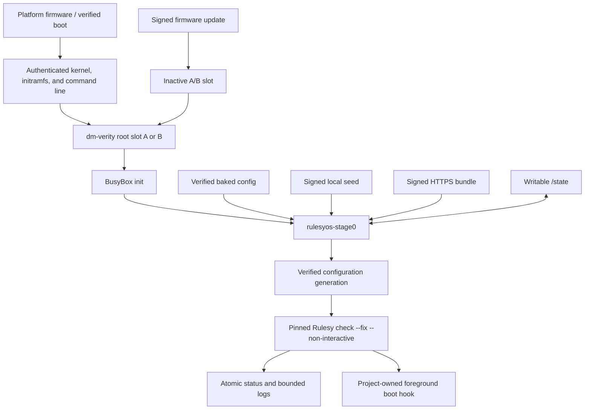

# RulesyOS product requirements and implementation design

**Status:** Proposed implementation handoff; not implemented

**Date:** 2026-07-26

**Owner:** RulesyOS

RulesyOS is a verified, minimal Linux firmware image that repeatedly converges
a machine by running an authenticated Rulesy configuration. This document owns
the stage-zero, Buildroot, boot, state, recovery, hardening, and OS-test
design. Host-side artifact composition belongs to the separate
[Rulesy Compose design](../../rulesy-compose/docs/design.md).

## 1. Product boundary

RulesyOS is a firmware-style Linux substrate, not a conventional package-based
distribution. Buildroot creates the complete stage-zero image; it is not an
on-target package manager.

RulesyOS owns:

- the platform-to-stage-zero trust chain;
- deterministic configuration acquisition and authentication;
- content-addressed configuration generations;
- boot-time invocation of Rulesy;
- immutable firmware updates, fallback, and recovery;
- persistent status and bounded logs; and
- board-specific kernel and userspace hardening.

Rulesy remains the only configuration evaluator. RulesyOS must not add
providers, resources, package semantics, enrollment, rollback semantics, or
OS-specific fields to Rulesy. It must invoke the public lifecycle:

```sh
/usr/bin/rulesy \
  --config=/run/rulesyos/config/current/rulesy.yaml \
  check --fix --non-interactive
```

RulesyOS pins an immutable released Rulesy version and verifies the resulting
target binary. Production firmware must not depend on a mutable workspace
build or an unreleased Rulesy checkout.

## 2. Contract-freeze gates

Milestone 0 must resolve these contracts against the then-current Rulesy
release:

1. **Authenticated closure.** A signed bundle is not complete if a local
   include or pattern can escape its root. Either Rulesy gains a narrow,
   generic bundle-root confinement mode or stage zero validates the complete
   closure without becoming a second evaluator.
2. **Results.** Rulesy's documented overall exit classes are sufficient for
   the initial stage-zero status envelope. Per-rule structured claims require
   an explicitly versioned Rulesy output format; stage zero must never scrape
   human prose.
3. **Version authority.** Firmware metadata, the packaged binary, CLI output,
   and release lock must agree on one released Rulesy version.
4. **Target compatibility.** The selected released Rulesy artifact must match
   the board profile. If a profile cannot use the official static release,
   Buildroot must build immutable released source with the selected toolchain.
5. **Provisioning lock.** The otherwise read-only firmware layout must allow
   Rulesy to securely create and hold its documented root lock path.

No OS implementation should claim production readiness before these gates have
executable acceptance tests.

## 3. Goals and non-goals

### Goals

- Preserve Rulesy's check, optional fix, and final-check behavior.
- Build a small, reproducible stage zero from pinned sources.
- Authenticate boot artifacts, firmware updates, and external configuration.
- Run Rulesy on every normal boot, even when configuration bytes are unchanged.
- Recover from firmware and configuration failures through separate loops.
- Remain minimally opinionated about project payloads above stage zero.
- Make firmware slot, generation, Rulesy result, and recovery state observable.

### Non-goals

RulesyOS v1 does not:

- turn Rulesy into a daemon, package manager, enrollment service, or rollback
  engine;
- host a package repository or compiler toolchain;
- ship an SSH server, web console, or unauthenticated production root shell;
- promise transactional rollback of arbitrary root-running fixes;
- sandbox a configuration signed by an authorized machine owner;
- include provider-specific cloud control-plane clients in the base image;
- publish machine, OCI, or cloud artifacts from the booted firmware; or
- attempt universal hardware support.

The configuration author owns everything above the documented stage-zero
contract, including payload service supervision and any alternate root.

## 4. Reference platform

The first supported profile is:

- x86-64 QEMU/KVM;
- UEFI-capable virtual hardware;
- virtio block, network, console, and random devices;
- GPT disk layout;
- a deliberately selected libc and documented ABI; and
- development and production-hardening configurations derived from one board
  definition.

An aarch64 QEMU profile is the preferred second target. Real hardware enters
through explicit board profiles rather than a universal reference kernel.
RulesyOS v1 is Linux-only.

## 5. Architecture



### Independent recovery loops

The firmware loop selects and verifies a slot, boots it, runs stage-zero
self-tests, and marks the firmware healthy. Rulesy compliance is not a
firmware-health signal.

The configuration loop selects one source, verifies a candidate, runs Rulesy,
and promotes the generation only after success. A failed candidate can be
quarantined by digest while the last successful generation remains selected.
Retaining that generation does not undo mutations already made by a failed
fix.

## 6. Buildroot and stage-zero components

Use a pinned Buildroot release or commit with a project-owned `BR2_EXTERNAL`
tree. Do not maintain an unnecessary Buildroot fork.

Suggested product layout:

```text
products/rulesyos/
  br2-external/
    external.desc
    Config.in
    external.mk
    configs/
      rulesyos_qemu_x86_64_defconfig
      rulesyos_qemu_aarch64_defconfig
    board/rulesyos/
      qemu_x86_64/
        linux.config
        busybox.config
        genimage.cfg
        rootfs-overlay/
        post-build.sh
        post-image.sh
    package/
      rulesy/
      rulesyos-stage0/
      rulesyosctl/
  crates/
    rulesyos-stage0/
    rulesyosctl/
  docs/
  tests/
    qemu/
    fixtures/
```

Future Rust code under this product owns a Cargo workspace independent from
`products/rulesy/Cargo.toml`.

### Build pipeline

The pipeline must:

- pin Buildroot, Linux, Rulesy, stage-zero, and every downloaded source;
- verify source hashes and avoid moving branches in release mode;
- cross-compile the kernel and complete userland;
- generate disk images, integrity metadata, and update bundles;
- emit checksums, signatures, package manifests, SBOMs, legal material, and
  build provenance;
- use fixture-only development keys for QEMU; and
- build non-interactively in a clean CI environment.

`output/target` is not a deployable root filesystem. Release only generated
images.

### Immutable root

The stage-zero root contains only what the documented profile requires:

- the pinned `/usr/bin/rulesy`;
- Bash and the documented BusyBox applets;
- `rulesyos-stage0` and `rulesyosctl`;
- signature verification and trust anchors;
- bounded HTTPS support and a CA bundle;
- firmware updater and recovery integration; and
- optional verified `/etc/rulesy.yaml`.

It does not contain Git, a package manager, an SDK, project payloads, publisher
clients, Compose, cloud credentials, or production private keys.

## 7. Boot and trust chain

Production boot must authenticate:

1. the platform boot entry;
2. kernel, initramfs, and effective kernel command line;
3. the selected root hash; and
4. every block read through the dm-verity root.

The root is mounted read-only. The dm-verity root hash must itself be covered
by an authenticated artifact. Verification failure closes or selects a known
recovery path; it must not silently boot an unsigned kernel or writable root.

BusyBox init performs a narrow sequence:

1. mount virtual filesystems and persistent state;
2. initialize devices and wait for cryptographic entropy;
3. configure the selected network profile;
4. start a watchdog when the board supports one;
5. run `rulesyos-stage0`; and
6. remain alive to reap children and perform shutdown.

## 8. Stage-zero contract

`rulesyos-stage0` is one small, auditable orchestrator. It:

- holds a singleton state-transition lock;
- identifies the firmware slot and boot ID;
- validates required mounts and permissions;
- selects exactly one configuration source by deterministic precedence;
- enforces download time, byte, file-count, and expansion limits;
- verifies signatures before materialization;
- creates content-addressed generations safely;
- invokes the pinned Rulesy with a fixed environment;
- maps documented Rulesy exit classes;
- writes atomic status and bounded logs;
- promotes or quarantines candidates under explicit policy;
- launches an eligible foreground payload hook after convergence; and
- marks firmware health separately from configuration compliance.

It does not parse Rulesy rules, synthesize fixes, reinterpret YAML, weaken
signature policy, or claim rollback of project mutations.

The guaranteed runtime environment includes:

- writable `/run`, `/tmp`, and `/state`;
- read-only `/` and `/usr`;
- predictable `PATH`, locale, umask, and hostname behavior;
- the exact documented shell and utility set; and
- no ambient secrets beyond explicitly configured sources.

## 9. Persistent state

`/state` is the only product-neutral persistent writable hierarchy guaranteed
by stage zero. RulesyOS-owned entries are root-owned and mode `0700` unless a
narrower file mode applies.

```text
/state/
  rulesyos/
    config/
      active
      previous
      candidates/
      generations/<sha256>/
      quarantined/
    firmware/
    logs/
    status/latest.json
    locks/
  bin/
  opt/
  roots/
  project/
```

Stage zero treats `/state` as mutable and potentially corrupt. It uses
descriptor-relative operations, rejects symlink/hardlink substitution at
security boundaries, writes temporary files in the destination filesystem,
fsyncs content and parent directories, and atomically renames completed state.

Firmware schemas remain readable by the previous firmware slot throughout the
rollback window. Migrations are additive or delayed until rollback is no longer
possible.

## 10. Configuration sources and bundles

Deterministic precedence:

1. verified configuration built into firmware;
2. one valid signed local seed;
3. one enrolled signed HTTPS source;
4. previously active verified generation.

Ambiguous sources at the same tier are errors. An unchanged digest does not
skip Rulesy execution.

External sources are signed bundles, not loose trusted YAML. A versioned
descriptor identifies:

- bundle schema and digest;
- root Rulesy configuration path;
- creation metadata that is not used as sole freshness authority;
- optional minimum RulesyOS and exact Rulesy compatibility;
- payload file list or Merkle/manifest coverage; and
- signature/key identity.

Before extraction, stage zero rejects absolute paths, `..`, duplicate
normalized paths, device nodes, FIFOs, sockets, unsafe symlinks/hardlinks,
excessive files, excessive bytes, and decompression bombs. It verifies the
detached signature and content digest before any included command can run.

The default firmware does not include Git or execute Rulesy's legacy `git+`
acquisition. Acquisition and authentication are complete before Rulesy starts.

HTTPS sources use restricted protocols, bounded redirects, connect/total
timeouts, size limits, CA validation, and redacted diagnostics. Implausible
wall-clock time must not silently disable certificate validation.

## 11. Configuration generations

Candidate lifecycle:

```text
acquired -> verified -> materialized -> selected -> running
    -> converged -> active
    -> compliance-failed -> quarantined by digest
    -> operational/transient failure -> retained for explicit retry policy
```

Promotion updates `previous` and `active` atomically only after Rulesy returns
the documented success class. Invalid signatures never create runnable
generations. Lock contention, interruption, and clearly transient operational
failures do not automatically quarantine content as semantically bad.

When no valid source and no active generation exist, stage zero reports
`unprovisioned`, keeps the verified base running, may retry a configured
network source with bounded backoff, and does not expose an inbound
administration service or automatic root shell.

## 12. Rulesy invocation and payload handoff

Rulesy runs as UID 0 in v1 with:

- a fixed absolute executable and configuration path;
- non-interactive mode;
- a documented minimal environment;
- bounded stdout/stderr capture;
- no inherited terminal;
- stage-zero's outer deadline and watchdog; and
- a recorded released Rulesy version and binary digest.

Rulesy exit `0` permits promotion. Compliance, configuration/operational,
lock-contention, and signal outcomes map to distinct RulesyOS status values.
Do not collapse them into one generic failure.

After successful convergence, stage zero may execute
`/state/rulesyos/boot` as the project-owned foreground payload hook. It opens
the file without following symlinks and verifies owner, type, mode, and link
count before execution. Backgrounding a daemon inside a Rulesy fix is not the
durable launch contract.

Reboot requests use a narrow `rulesyosctl request-reboot` protocol so stage
zero can commit status before reboot. An alternate-root handoff is deferred
until its filesystem and lifecycle contract is specified.

## 13. Firmware updates and recovery

Production firmware uses whole-image signed updates with A/B slots:

- write only the inactive slot;
- verify the bundle's board/profile compatibility;
- retain bounded boot-attempt counters;
- mark good only after firmware self-tests;
- fall back after a failed boot;
- preserve one bootable slot across power loss; and
- keep firmware and configuration signing keys distinct.

Rulesy convergence is not a firmware mark-good condition. A bad configuration
must not roll back an otherwise necessary firmware security update.

Recovery uses an independently verifiable boot path capable of inspecting
status, selecting a known firmware slot, and repairing narrowly scoped
RulesyOS state. It must not automatically expose a production root shell.

Firmware trust anchors rotate only through an already trusted firmware/update
chain. Configuration-key rotation normally arrives through signed firmware
until a separate signed key-manifest protocol is approved.

## 14. Hardening

Each board profile has a checked kernel policy:

- strict kernel/module RWX, stack protector, FORTIFY, hardened usercopy, and
  initialization hardening;
- KASLR and lockdown where supported;
- signed modules with enforcement, or no loadable modules;
- disabled unrestricted `/dev/mem`, kexec, debugfs, tracing, perf, and
  unprivileged BPF unless explicitly justified;
- only required drivers, filesystems, protocols, and executable formats; and
- secure sysctls and entropy readiness before cryptography.

Publish explicit capability profiles such as `minimal`, `generic`, and
`container`. Kernel features cannot be downloaded later by a Rulesy
configuration.

Userspace has no default inbound listener, reusable root password, or
unauthenticated production getty. `/run` and `/tmp` use restrictive mount
flags. Logs redact URL userinfo/query strings, credentials, environment
secrets, and configuration contents.

The default is a trusted-root configuration profile: an authorized Rulesy
configuration can intentionally damage writable devices or boot metadata.
dm-verity and lockdown are not a sandbox for root-running Bash. Any future
restricted profile must advertise the operations it removes and test that
separate threat model.

## 15. Status and logs

Stage zero atomically replaces
`/state/rulesyos/status/latest.json` using a versioned schema:

```json
{
  "schemaVersion": 1,
  "bootId": "opaque-id",
  "rulesyosVersion": "0.1.0",
  "firmwareSlot": "A",
  "firmwareHealthy": true,
  "sourceKind": "https-bundle",
  "configDigest": "sha256:...",
  "candidateDigest": null,
  "rulesyVersion": "x.y.z",
  "rulesyExit": 0,
  "outcome": "converged",
  "durationMs": 7000
}
```

Stable outcomes include `unprovisioned`, `acquisition-failed`,
`verification-failed`, `candidate-quarantined`, `converged`,
`compliance-failed`, `operational-failed`, `lock-contended`, `interrupted`,
and `firmware-degraded`.

Wall-clock fields may be null when time is not trustworthy. Preserve bounded
per-boot stage-zero and Rulesy logs and rotate by both bytes and boot count.
Remote telemetry is not mandatory in v1.

## 16. Release artifacts

Each RulesyOS release emits:

- complete QEMU/flashable disk image;
- authenticated kernel/initramfs or unified boot artifact;
- immutable root images and verity metadata;
- signed firmware update bundle;
- checksum manifest and detached release signature;
- Buildroot, kernel, and BusyBox configurations;
- package manifest, SBOM, legal-info archive, and provenance;
- the pinned Rulesy version and binary/source digest; and
- QEMU test report.

These are base RulesyOS artifacts. Service-specific composed artifacts belong
to Rulesy Compose.

## 17. Testing strategy

### Unit and parser tests

- source precedence and ambiguity;
- descriptor and archive validation;
- signature policy and digest calculation;
- URL redaction and resource limits;
- generation promotion, quarantine, and interrupted-write recovery;
- Rulesy exit mapping; and
- versioned status serialization.

### QEMU integration tests

The tests boot actual produced images and cover:

1. no configuration and baked configuration;
2. valid, invalid, and unsigned seed bundles;
3. valid signed HTTPS acquisition and unavailable remote fallback;
4. Rulesy execution on unchanged content;
5. success promotion and failure quarantine policy;
6. atomic recovery across every materialization/promotion interruption point;
7. authenticated include closure and traversal rejection;
8. every Rulesy exit/status class;
9. read-only root and persistent state;
10. no unexpected listener or unauthenticated console;
11. hostile inputs, oversized responses, and redirect restrictions;
12. payload-hook eligibility and descendant cleanup;
13. idempotent repeated convergence;
14. provisioning-lock contention; and
15. the documented tool, environment, and mount contract.

### Verified boot, update, and recovery

- rootfs corruption rejected by dm-verity;
- boot-artifact corruption and unsigned updates rejected;
- wrong-profile update rejected;
- inactive-slot-only writes;
- successful mark-good and failed-boot fallback;
- configuration failure independent from firmware health;
- power-loss safety at each update transition; and
- absence of development private keys.

### Hardening and build tests

- kernel configuration audit;
- module and mount enforcement;
- credential, port-scan, and debug-interface negatives;
- secret-redaction fixtures;
- archive/descriptor fuzzing;
- clean and offline-cache rebuilds;
- checked source hashes and no moving release inputs;
- SBOM/legal-info generation; and
- reproducibility comparison with documented exceptions.

## 18. Acceptance criteria

The functional MVP:

- boots the reference QEMU image through the verified stage-zero path;
- runs a pinned released Rulesy on every boot;
- authenticates and atomically promotes signed configuration;
- retains last successful selection without claiming rollback;
- records stable status and bounded logs;
- launches an eligible foreground payload hook;
- survives reboot and interrupted state transitions; and
- has no default inbound administration service.

Production hardening additionally requires verified boot, A/B firmware
fallback, recovery, key-rotation policy, checked kernel/userspace hardening,
signed release artifacts, complete provenance/SBOM coverage, and all negative
security tests.

## 19. Milestones

1. **Contract freeze:** pin a released Rulesy and close bundle, result, version,
   target, and lock-path contracts.
2. **Bootable reference image:** Buildroot, BusyBox init, immutable root,
   persistent state, console status, and baked configuration.
3. **Trusted configuration pipeline:** signed seed/HTTPS bundles, generations,
   Rulesy execution, promotion, quarantine, and payload hook.
4. **Production boot hardening:** verified boot, dm-verity, capability
   profiles, no insecure console/listeners, and hardening tests.
5. **Firmware update and recovery:** A/B updates, mark-good, fallback,
   power-loss testing, and key rotation.
6. **Additional board profiles:** aarch64 QEMU first, then explicitly approved
   hardware.

Rulesy Compose milestones are independent and live in its own design.

## 20. Principal risks

- **Distribution creep:** adding a package ecosystem or universal kernel
  destroys the small stage-zero boundary.
- **Rulesy absorbs OS concerns:** acquisition, trust, state, and recovery must
  stay in RulesyOS.
- **Rollback overclaim:** selecting an older configuration does not reverse
  arbitrary mutations.
- **Authorized-root threat:** signed root-running Bash is trusted, not
  sandboxed.
- **State corruption:** mutable `/state` requires descriptor-safe and
  power-loss-safe transitions.
- **Firmware/config coupling:** separate health loops and trust roots are
  mandatory.
- **Hardware matrix growth:** every board/profile multiplies kernel and
  recovery testing.
- **Bundle incompleteness:** external trust claims fail if includes or assets
  escape the authenticated closure.

## 21. Implementation rule

Start with milestone 0 and the QEMU reference profile. Do not add cloud
publishers, Compose code, package-manager policy, or extra hardware before the
stage-zero contracts are executable and tested. When a contract requires a
Rulesy change, keep that change generic and independently useful to the
provisioner rather than adding RulesyOS semantics.
